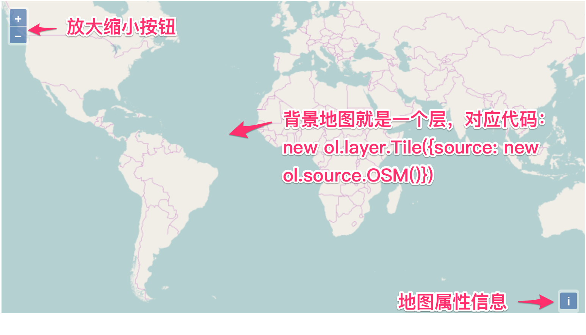
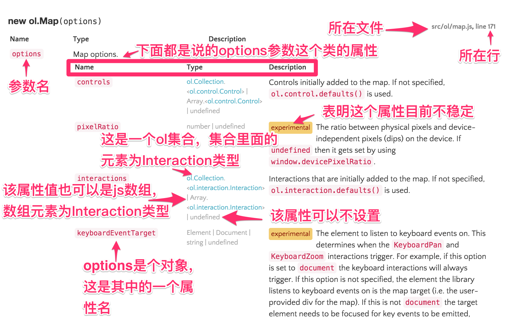

# OpenLayers 3地图

本章节将围绕前面那个简单的地图展开，从源码分析入手，逐步延伸到地图组成部分的分析，并学会借助API文档来帮助我们理解。 在此基础上，还提供了一些关于`ol.Map`类的应用实例，以帮助大家进一步的实践，为接下来更深入的学习和使用打下坚实的基础。

<!-- more -->

# 初步解析地图组成

创建地图的代码如此简单，以致于让一部分初学者误认为在此基础上的深入开发也很简单，这是一个非常错误的理解。此时，最关键的第一步是先弄明白每一句代码的含义，理解他们是如何组织起来的。否则，在后续的学习和使用过程中，犹如瞎子摸象，会找不到问题的关键点而迷失方向。让我们再次回顾一下之前那个简单地图的代码：

``` javascript
		// 创建地图
	  new ol.Map({
			// 设置地图图层
			layers: [
			  // 创建一个使用Open Street Map地图源的瓦片图层
			  new ol.layer.Tile({source: new ol.source.OSM()})
			],
			// 设置显示地图的视图
			view: new ol.View({
			  center: [0, 0],	// 定义地图显示中心于经度0度，纬度0度处
			  zoom: 2			// 并且定义地图显示层级为2
			}),
			// 让id为map的div作为地图的容器
			target: 'map'	
		});
```

注意，其实上面这段代码就只有一条语句:
``` javascript
new ol.Map({...});
```
其他代码只是用于设置地图的构造参数。由此可以推测出`ol.Map`是最主要的地图类，创建地图就需要构造这么一个对象。接下来依次分析每一个参数部分的代码。

* 参数`layers`:
``` javascript	
layers: [
			  // 创建一个使用Open Street Map地图源的瓦片图层
			  new ol.layer.Tile({source: new ol.source.OSM()})
			],
```
从名字和具体的值可见这个地方可以设置多个`layer`，它是OpenLayers 3地图的组成结构单元，地图是由多个`layer`组成的，这种设计类似于Photoshop里面的图层，多个图层是可以叠加的，在最上面的会覆盖下面的，以此类推。在代码中我们添加了一个[Open Street Map](http://www.openstreetmap.org/	)的地图`layer`。

* 参数`view`：
``` javascript
view: new ol.View({
			  center: [0, 0],	// 定义地图显示中心于经度0度，纬度0度处
			  zoom: 2			// 并且定义地图显示层级为2
			}),
```
通过字面意思可以看出，它为地图定义显示窗口，对应`ol.View`类，可以自定义地图显示的中心点，缩放层级等。

* 参数`target`：
``` javascript
target: 'map'	
```
指定地图在页面中具体哪个位置进行显示，为此要记住地图显示还是离不开使用dom来实现。虽然和地图业务没什么关系，但也必不可少，因为它是`Web GIS`，最基本的还是依赖于HTML。

通过上面的源码解读，我们可以发现OpenLayers 3地图主要是由`layer`和`view`组成，`layer`可以有多个，`view`只能有一个。


上图能明确看到的是`layer`，看不出`view`在哪儿，只知道地图显示中心确实在经度0，纬度0处。除此之外，还能看到左上角的放大缩小按钮，以及右下角的属性信息按钮。如果在地图上双击鼠标左键，或者按住鼠标左键拖动，可以看到地图也是会放大或者移动的。这些都是分析代码并没有看到的。很明显OpenLayers 3有很多默认行为，一个地图的完整构成，远不是只有`view`和`layer`就行了。


# 地图所有组成部分

那么OpenLayers 3究竟由哪些部分组成？下面就将核心组成部分一一罗列出来：
* 地图(Map)，对应的类是`ol.Map`，之前已有接触。从代码上来看，它就像是一个空壳子，感觉没做什么实事，因为具体事务都由其他组成部分处理了。但没有它，整个地图的其他组成部分就不能有效协调，组织在一起。同时对于开发者而言，它就是第一个入口，我们必须要掌握。
* 视图(View)，对应的类是`ol.View`，之前已有接触，控制地图显示的中心位置，范围，层级等，此处不再过多介绍。关于其详细说明参见[View](../ch04/index.md)。
* 图层(Layer)，OpenLayers 3有多种多样用于不同业务的图层，每一种图层在实现上都对应于一个类，放在包`ol.layer`下面，之前已接触过的`ol.layer.Tile`就是其中的一种。OpenLayers 3允许多个`layer`重叠在一起，相互之间互不干扰，是一种图形显示和管理的有效方式。应用这种方式能有效处理地图数据来源的多样性和复杂性问题。对开发者而言，它更多的表现为组织管理的类。
* 数据源(Source)，它是和图层一一对应的，OpenLayers 3也存在多种不同的数据源，每一种在实现上也对应于一个具体的类，它们都放在包`ol.source`下面，之前接触过的`ol.source.OSM`就是其中的一种。 毫无 疑问，它是整个地图背后真正的核心。 如果没有数据，那么渲染引擎将没有任何价值。在数据技术(Data Technology)大行其道的今天，GIS引擎将需要支持各式各样的数据来源。目前ol3也确实是这样做的，已支持多种多样在线或离线的数据源；可以是静态图或者瓦片图；也可以是栅格化的或者矢量的。如果你想在地图上加载某种格式的数据，或者某种服务提供的数据，都可以优先查看一下OpenLayers 3是否已经支持了。图层和数据源是密不可分的，详情可参见[Source和Layer](../ch05/index.md)。
* 控件(Control)，它为用户提供了和地图交互的入口。 针对不同的用途，具有不同的控件。其实现类都放在包`ol.control`下面，在此之前还没有具体接触过，但我们在地图上看到的放大缩小按钮就是众多控件中的一种。控件具备相同的一个特性，就是一直保持在地图的某个固定位置，不会随着地图移动而移动，也不会随着地图放大缩小而变化，一直处于地图的最上层。关于控件更详细的说明参见[Control](../ch10/index.md)。
* 交互(Interaction)，这是所有软件都具备的一个组成部分，直观地是看不见的，其实现类放在包`ol.interaction`下面，之前也没具体接触过，但其实是使用到了，如果没有它，我们就没有办法直接用鼠标控制地图放大、缩小、移动。这并不仅仅存在于GIS引擎中，它存在于任何产品中。任何优秀的产品必然有着良好的交互能力，即使没有任何GIS知识，也能体会到它的作用和重要性。

以上就是一个OpenLayer 3地图所有核心的组成部分， 他们有机的组合在一起，从而构成整个地图，实现了我们对地图的完整需要。 OpenLayer 3采用这样的模块化设计，不管是在实现上，还是对外提供API，都简化了整个系统。我们只要完整地了解每一个组成部分，就能游刃有余地运用它。在这些组成部分中，只有`Layer`和`Source`有直接的强联系，其他的组成部分，相互之间的联系很少。为此，在掌握某一部分后，就可以有效地处理这一部分的开发工作，从而不一定要掌握所有组成部分。 本教程的章节也是按照各个模块来分别介绍的，并不一定需要按照章节顺序进行学习。


# 看懂API

或许你已经迫不及待的想开始学习第一个组成部分`Map`了，但在此之前，还是不得不先学会使用官网的API文档。因为API的重要性众人皆知，对于一个快速开发中的开源项目，更是如此，每一个小版本之间都可能有些许变化。所以在更新版本后，如果遇到API方法不存在或者功能不正确，则需要优先核对官网API文档。本着授之以鱼不如授之以渔的原则，学会看懂API文档是关键，而不是翻译API文档。。

## API文档入口
在浏览器中打开[OpenLayers官网 http://openlayers.org/](http://openlayers.org/)，下图箭头所指向的地方即为API文档链接：


点击进入即为整个API文档的首页，页面上方为工具栏，左边为搜索栏和列表，右边为OpenLayers 3组成部分的介绍，都是相关的类和一些简介。


上方工具栏中的`Stable Only`复选框选中后，API文档就只会显示功能已经稳定的类，参数，接口等信息。在查找新功能或新特性时，建议不要勾选。 

右边页面显示了地图组成的介绍，Map、View、Layers列在第一排，第二排及第三排依次列出了其他的组成部分。有简单的介绍，及对应的包和类，可以通过这些资料加深对他们的认识。

## 查找
左边的列表会根据搜索栏的内容进行过滤。大家可以尝试一下，在这里能搜索包名，类名，方法名和事件名。包名比如`ol.layer`，`ol.source`等，方法名比如`setCenter`，`setZoom`等，类名比如`View`，`Map`等，事件名比如`change:layers。但目前还不支持文档里面的内容的文本搜索。

## API文档介绍
此处以`ol.Map`类的API文档为例进行说明。在搜索栏输入`ol.Map`，很快下方列表中的内容就变了，排在中第一项的就是`ol.Map`类，点击它，右边页面内容就变成了它的说明文档。文档内容从上向下，共分为三部分：
* 类介绍，主要介绍该类用途，建议仔细阅读，这样才能根据具体业务找对需要的类。
* 构造参数、事件及继承关系，该内容的重要性无需多言，看不明白，就无法创建该类的对象。
* 类的所有方法，建议浏览一下，了解每个方法所实现的功能，在需要时，再详细查看对应的参数和使用方式。

请结合上面的内容快速浏览一下`ol.Map`的说明文档，感受一下，总的来说，OpenLayers 3的API文档是比较全面的，内容也挺详实(ol3的API文档是从代码的注释中通过工具提取生产的，所以时刻能保持更新，且完全符合JSDoc规范，文档和代码完全匹配)。

文档中类的介绍部分是否能看懂，因人而异，当了解的越多，就越容易看明白。因为它只是类的一些简要说明，谈不上详细，也没有对应的应用说明。有些类的用途需要结合到其他的知识才能更明白。在不是很明白的情况下，建议多结合类提供的方法的用途来一起理解。

类的构造参数采用的是[JSDoc](http://usejsdoc.org/)规范定义的，使用工具提取而出，生成了下面的参数文档，在此对其格式进行简要说明，参见下面图解：


页面右边的文件和行号标注都是可点击的，点击打开跳转到对应的源码，对于探究背后实现，或者分析Bug非常有用。然后是参数说明，很多对象的构造参数都是对象，以`{key1:value1, key2:value2}`这样的方式设置。这种方式有两方面的好处：
* 可以只设置需要的参数，或者增加自定义参数
* 易于为指定参数设置正确的值，避免值对应到错误的参数上。

需要注意的是参数类型`Type`的说明，使用符号`|`表示该参数可以赋予多种类型的值，对开发者是非常友好的，灵活强大。参数类型如果是容器，都会使用`<>`来表示。如果是OpenLayers 3自定义的类型，都是可以点击查看的。若为JavaScript的原生类型或DOM类型，则只给出类型名。对于各个参数的描述信息，就是一段文字，都比较详细。

除了参数之外，在OpenLayers 3中还大量使用了事件，用于解决实时通知的问题，这是典型的观察者模式。当对象改变时，能触发相应的操作。在API文档中，明确标注了各个类的事件，以及触发该事件的条件和时机。它们都列在`Fires:`这一栏，比如`ol.Map`就有很多事件，`click`、`dbclick`、`singleclick`、`moveend`等等。这些事件对于开发者来说非常重要，除了OpenLayers 3需要大量使用这些事件，很多应用开发也需要使用它们来实现一些关键功能。关于事件更详细的说明参见[事件](../ch07/index.md)。

在事件说明之后，还有类继承的说明。`Subclasses`列出了当前类的所有子类；`Extends`列出了当前类的父类。不要小瞧这个说明，因为在面向对象编程范式中，所有能用父类的地方，都可以用子类。比如`ol.Map`的构造参数`options`可以设置`layers`属性，它的值是`ol.layer.Base`类型元素的集合，那么就可以用`ol.layer.Base`的子类`ol.layer.Group`或`ol.layer.Layer`，以此类推，也可以用这两个类的子类`ol.layer.Image`、`ol.layer.Tile`、`ol.layer.Vector`等。这样我们就知道具体哪些参数能用哪些类了。

最后就是这个类所有方法的说明了。方法的说明包含方法名，参数，以及方法功能描述。同类的说明差不多，为此不再累述。

最后，提醒一下，在遇到任何问题时，请优先查询API文档来排忧解惑。


# 结合API文档分析代码
这次，有了API文档这个利器，必然会对代码有更深入的理解和认识。让我们再一次回顾之前那个简单的地图的代码：

``` javascript
		// 创建地图
	  new ol.Map({
			// 设置地图图层
			layers: [
			  // 创建一个使用Open Street Map地图源的瓦片图层
			  new ol.layer.Tile({source: new ol.source.OSM()})
			],
			// 设置显示地图的视图
			view: new ol.View({
			  center: [0, 0],	// 定义地图显示中心于经度0度，纬度0度处
			  zoom: 2			// 并且定义地图显示层级为2
			}),
			// 让id为map的div作为地图的容器
			target: 'map'	
		});
```

之前我们并不知道`ol.Map`类具体有什么构造参数，也不知道参数值可以设置什么类型的对象等等，现在就可以通过API文档查看。通过API文档可以看到，构造参数远不止上面代码中设置的这些参数，还存在很多其他的参数。这些参数在文档中注明是可以不设置的，OpenLayers3 会自动使用特定的默认值。通过这些参数，你是否已经发现它们其实就是地图的组成部分。为什么有些参数可以不设置而使用默认值，而有些参数就必须设置呢？请自行思考。

文档显示`ol.Map`的构造参数`layers`，可以是`ol.Collection`，也可以是Javascript数组，此处用了数组。我们统称为容器类型，包含的元素为`ol.layer.Base`类型。但代码里面创建了一个`ol.layer.Tile`类的实例，这样也行？通过API文档中的继承关系信息，我们可以了解到`ol.layer.Tile`继承于`ol.layer.Layer`，而`ol.layer.Layer`又继承于`ol.layer.Base`，所以这是可行的。

，若对`ol.layer.Tile`不了解，请使用API文档，在此之前，我们也可以通过包名大致推断出它是一个`layer`，属于地图层的一种。官网API文档说明：它是一种应用瓦片图片作为地图源的地图层。构造函数的参数里包含一个必须设置值的属性：`source`，用于设置地图源，类型为`ol.source.Tile`，但是代码里使用的是`ol.source.OSM`，这个问题同上，请自行查询API文档解答吧。注意，`Layer`和`Source`就是这样绑定在一起的。有什么样的`Layer`，就需要什么样的`Source`，看起来是`Layer`决定`Source`，其实`Layer`是为`Source`服务的，还是之前说的那样，数据才是最重要的。所以应该是`Source`起决定作用，根据需要构造对应的`Layer`。为此在做开发时，应该优先考虑需要什么样的`Source`。这个也可以通过API文档来查找，搜索`ol.source`即可查看到现有哪些不同类型的`source`，在结果中逐个查看，直到找到需要的`source`类。假设找到了`ol.source.Test`，那么要找`layer`就简单了，一般情况下，会有`ol.layer.Test`。 如果没有，请查找`ol.source.Test`的父类对应的`layer`，以此类推。

参数`View`是一个必须设置的属性，对应于`ol.View`类，通过官网API了解详细信息，顺便详细看看它的构造参数中的`center`和`zoom`表示什么？`View`至关重要，后续将更深入的了解。

认真查看API文档，可以发现一些你意想不到的东西，从而有所启发，或学到新知识，或排忧解难，所以请重视API文档。至此，你应该对上面的代码有了非常深入的理解了，此时不妨试试修改一些参数的值，查看地图有什么变化。


# ol.Map的应用

到此，已经学习了足够多的知识，对`ol.Map`也比较熟悉了，如果遇到问题，也能从API文档中得到帮助，是时候动动手练习一下了。这之后就给出一些简单的应用，有兴趣的可以看看，没兴趣的可以直接跳过，进入下一章节。


# 定制地图logo
OpenLayers 3作为一个引擎，供开发者二次开发来发布产品，必然需要重新设置logo，具体怎么做？通过`ol.Map`的API文档发现它的构造参数里面`logo`的设置，简单动动手就能做出下面这样带自定义`logo`的地图，注意右下角的猴子：

<head>                  
	<link href="../src/ol3.13.1/ol.css" rel="stylesheet" type="text/css" />
	<script type="text/javascript" src="../src/ol3.13.1/ol.js" charset="utf-8"></script>
</head>

<div id="map" style="width: 100%, height: 400px"></div>
<script>
  new ol.Map({
  	controls: ol.control.defaults({
          attributionOptions: ({
            collapsible: false
          })
        }),
		// logo: false, 	// 不显示logo
		// logo: 'face_monkey.png', 	// 用一个图片 face_monkey.png 作为logo
		logo: {src: '../img/face_monkey.png', href: 'http://www.openstreetmap.org/'},	// 点击能跳转到对应页面
		layers: [
			new ol.layer.Tile({source: new ol.source.OSM()})
		],
		view: new ol.View({
			center: [0, 0],
			zoom: 2
		}),
		target: 'map'
  });
</script>

因为今年是猴年，所以就用了它，当然你也可以换成任何其他想要的`logo`，代码如下：

``` html
<div id="map" style="width: 100%, height: 400px"></div>
<script>
  new ol.Map({
  	controls: ol.control.defaults({
          attributionOptions: ({
            collapsible: false
          })
        }),
		// logo: false, 	// 不显示logo
		// logo: 'face_monkey.png', 	// 用一个图片 face_monkey.png 作为logo
		logo: {src: '../img/face_monkey.png', href: 'http://www.openstreetmap.org/'},	// 点击能跳转到对应页面
		layers: [
			new ol.layer.Tile({source: new ol.source.OSM()})
		],
		view: new ol.View({
			center: [0, 0],
			zoom: 2
		}),
		target: 'map'
  });
</script>
```

注意看代码中设置`logo`参数的注释，演示了最复杂的情况，注释掉的代码是一些简单的用法。可自行尝试换成它们有什么效果。

除了`logo`参数之外，我们还设置了`controls`，算是这个例子夹带的私货，其大致的作用，从官网API文档可以了解到，是设置地图控件的。有什么作用？注意对比现在的地图和之前的地图的右下角，一个是**i**，一个是展开的一串信息。 


# 单页面多地图
在某些业务中，可能需要在一个页面中加载多个地图，用于对比，或者多个业务方面的同时展示。那么OpenLayers 3能否做到单页面多地图互不干扰呢？

<head>                  
	<link href="../src/ol3.13.1/ol.css" rel="stylesheet" type="text/css" />
	<script type="text/javascript" src="../src/ol3.13.1/ol.js" charset="utf-8"></script>
</head>
<p>地图1</p>
<div id="map1" style="width: 100%"></div>
<p>地图2</p>
<div id="map2" style="width: 100%"></div>
<script>
	// 创建第一个地图
  new ol.Map({
		layers: [
			new ol.layer.Tile({source: new ol.source.OSM()})
		],
		view: new ol.View({
			center: [0, 0],
			zoom: 2
		}),
		target: 'map1'
  });
	
	// 创建第二个地图
	new ol.Map({
		layers: [
			new ol.layer.Tile({source: new ol.source.OSM()})
		],
		view: new ol.View({
			center: [0, 0],
			zoom: 2
		}),
		target: 'map2'
  });
</script>

试试两个地图都操作一下，确认相互之间是否有影响？对应的代码非常简单，无非就是数量多了一个，如下：

``` html
<p>地图1</p>
<div id="map1" style="width: 100%"></div>
<p>地图2</p>
<div id="map2" style="width: 100%"></div>
<script>
	// 创建第一个地图
  new ol.Map({
		layers: [
			new ol.layer.Tile({source: new ol.source.OSM()})
		],
		view: new ol.View({
			center: [0, 0],
			zoom: 2
		}),
		target: 'map1'
  });
	
	// 创建第二个地图
	new ol.Map({
		layers: [
			new ol.layer.Tile({source: new ol.source.OSM()})
		],
		view: new ol.View({
			center: [0, 0],
			zoom: 2
		}),
		target: 'map2'
  });
</script>
```

这段代码真没有什么需要解释的了。


# 地图联动
OpenLayers 3采用了MVC模型，V对应的就是`View`，这种设计模型有什么好处？我们还是直接看下面这两个地图：

<head>                  
	<link href="../src/ol3.13.1/ol.css" rel="stylesheet" type="text/css" />
	<script type="text/javascript" src="../src/ol3.13.1/ol.js" charset="utf-8"></script>
</head>
<p>地图1</p>
<div id="map1" style="width: 100%"></div>
<p>地图2</p>
<div id="map2" style="width: 100%"></div>
<script>
	// 创建一个视图
	var view = new ol.View({
			center: [0, 0],
			zoom: 2
		});

	// 创建第一个地图
  new ol.Map({
		layers: [
			new ol.layer.Tile({source: new ol.source.OSM()})
		],
		view: view,
		target: 'map1'
  });
	
	// 创建第二个地图
	new ol.Map({
		layers: [
			new ol.layer.Tile({source: new ol.source.OSM()})
		],
		view: view,
		target: 'map2'
  });
</script>

拖动地图1的同时，看看地图2有什么变化，是不是很神奇，为什么呢？

``` html
<p>地图1</p>
<div id="map1" style="width: 100%"></div>
<p>地图2</p>
<div id="map2" style="width: 100%"></div>
<script>
	// 创建一个视图
	var view = new ol.View({
			center: [0, 0],
			zoom: 2
		});

	// 创建第一个地图
  new ol.Map({
		layers: [
			new ol.layer.Tile({source: new ol.source.OSM()})
		],
		view: view,
		target: 'map1'
  });
	
	// 创建第二个地图
	new ol.Map({
		layers: [
			new ol.layer.Tile({source: new ol.source.OSM()})
		],
		view: view,
		target: 'map2'
  });
</script>
```
代码只有一点不同，即两个`ol.Map`使用了同一个`view`，就是这么神奇。


# 动态交换地图
在创建地图时，我们可以指定对应的地图容器，其实在创建完成之后，我们还可以动态设置不同的地图容器，从而可以让地图不断的变换位置，比如交换两个地图：

<head>                  
	<link href="../src/ol3.13.1/ol.css" rel="stylesheet" type="text/css" />
	<script type="text/javascript" src="../src/ol3.13.1/ol.js" charset="utf-8"></script>
</head>

<p>地图1</p>
<div id="map1" style="width: 100%"></div>
<p>地图2</p>
<div id="map2" style="width: 100%"></div>
<input type="button" onClick="swapMap();" value="调换地图" />
<script>
	// 创建第一个地图
  var map1 = new ol.Map({
		layers: [
			new ol.layer.Tile({source: new ol.source.OSM()})
		],
		view: new ol.View({
			center: [0, 0],
			zoom: 2
		}),
		target: 'map1'
  });
	
	// 创建第二个地图
	var map2 = new ol.Map({
		layers: [
			new ol.layer.Tile({source: new ol.source.OSM()})
		],
		view: new ol.View({
			center: [0, 0],
			zoom: 2
		}),
		target: 'map2'
  });
	
	function swapMap() {
		// 改变两个地图的容器
		map1.setTarget('map2');
		map2.setTarget('map1');
	}
</script>

为了让两个地图有所差别，你可以先放大第一个地图，然后点击**调换地图**按钮，看一下效果。要实现这个功能，其实只需要使用`setTarget`方法即可：

``` html
<p>地图1</p>
<div id="map1" style="width: 100%"></div>
<p>地图2</p>
<div id="map2" style="width: 100%"></div>
<input type="button" onClick="swapMap();" value="调换地图" />
<script>
	// 创建第一个地图
  var map1 = new ol.Map({
		layers: [
			new ol.layer.Tile({source: new ol.source.OSM()})
		],
		view: new ol.View({
			center: [0, 0],
			zoom: 2
		}),
		target: 'map1'
  });
	
	// 创建第二个地图
	var map2 = new ol.Map({
		layers: [
			new ol.layer.Tile({source: new ol.source.OSM()})
		],
		view: new ol.View({
			center: [0, 0],
			zoom: 2
		}),
		target: 'map2'
  });
	
	function swapMap() {
		// 改变两个地图的容器
		map1.setTarget('map2');
		map2.setTarget('map1');
	}
</script>
```
其实很多时候，只需要多留意一下API文档里面的方法，了解功能，就可能实现意想不到效果。

