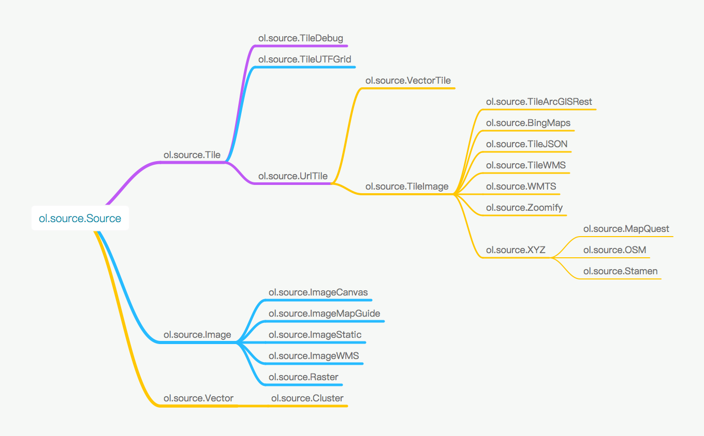
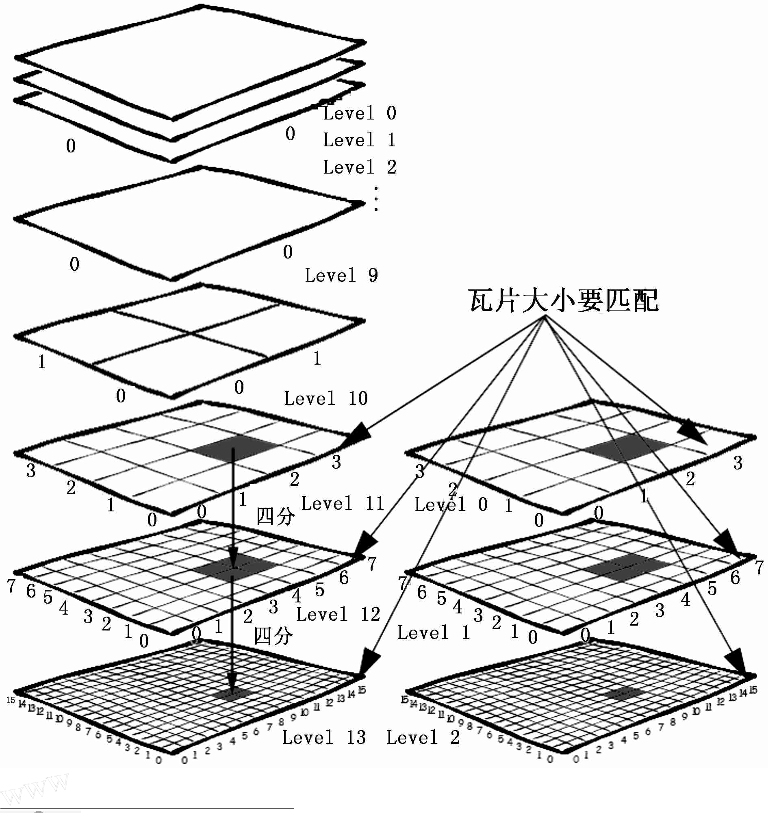
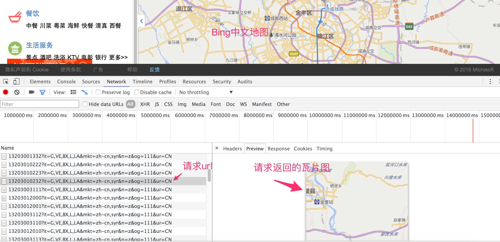
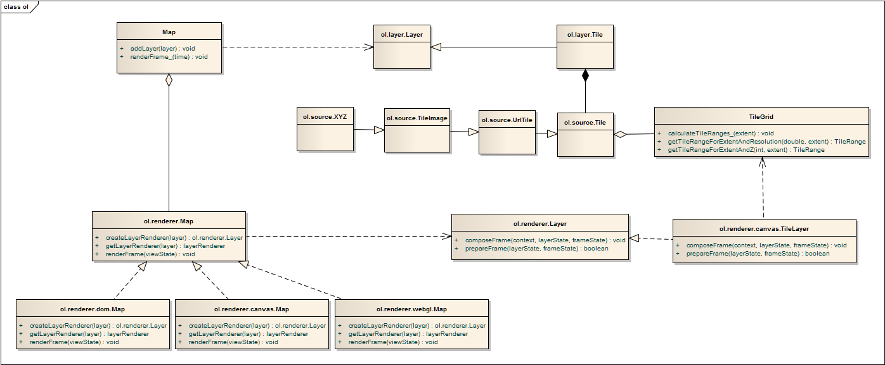
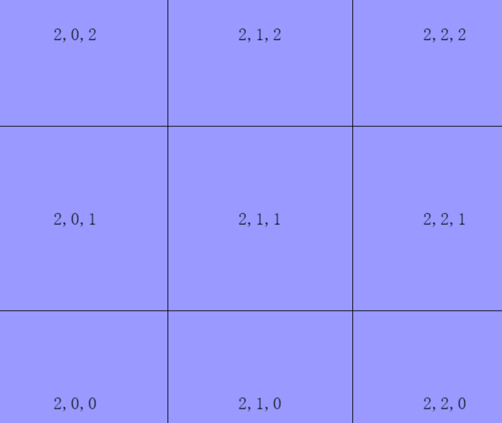

# Source和Layer

在前面的例子中，已经对`Source`和`Layer`有所了解了。比如我们加载了Open Street Map的地图。然而世界上的地图并不只有Open Street Map，还有很多其他的地图，比如Google地图，天地图，高德地图，百度地图等。如果OpenLayers支持的地图来源越多，就会越适用，越强大。除了加载基本的地图之外，GIS还需要加载很多其他的信息，比如街道名称，商店名称，公交站点，道路等等。那么在OpenLayers 3中，具体该如何把这些添加在地图上呢？

<!-- more -->

首先需要明白的一点是，`Source`和`Layer`是一对一的关系，有一个`Source`，必然需要一个`Layer`，然后把这个`Layer`添加到`Map`上，就可以显示出来了。通过官网的API搜索`ol.source`可以发现有很多不同的`Source`，但归纳起来共三种：`ol.source.Tile`，`ol.source.Image`和`ol.source.Vector`。 

* `ol.source.Tile`对应的是瓦片数据源，现在网页地图服务中，绝大多数都是使用的瓦片地图，而OpenLayers 3作为一个WebGIS引擎，理所当然应该支持瓦片。
* `ol.source.Image`对应的是一整张图，而不像瓦片那样很多张图，从而无需切片，也可以加载一些地图，适用于一些小场景地图。
* `ol.source.Vector`对应的是矢量地图源，点，线，面等等常用的地图元素(Feature)，就囊括到这里面了。这样看来，只要这两种`Source`就可以搞定80%的需求了。

从复杂度来分析，`ol.source.Image`和`ol.source.Vector`都不复杂，其数据格式和来源方式都简单。而`ol.source.Tile`则不一样，由于一些历史问题，多个服务提供商，多种标准等诸多原因，导致要支持世界上大多数的瓦片数据源，就需要针对这些差异提供不同的`Tile`数据源支持。在更进一步了解之前，我们先来看一下OpenLayers 3现在支持的`Source`具体有哪些：


上图中的类是按照继承关系，从左向右展开的，左边的为父类，右边的为子类。在使用时，一般来说，都是直接使用叶子节点上的类，基本就可以完成需求。父类需要自己进一步扩展或者处理才能有效使用的。

我们先了解最为复杂的`ol.source.Tile`，其叶子节点类有很多，大致可以分为几类：
* 在线服务的`Source`，包括`ol.source.BingMaps`(使用的是微软提供的Bing在线地图数据)，`ol.source.MapQuest`(使用的是MapQuest提供的在线地图数据)<font color=#ff0000>(注: 由于MapQuest开始收费，ol v3.17.0就移除了`ol.source.MapQuest`)</font>，`ol.source.OSM`(使用的是Open Street Map提供的在线地图数据)，`ol.source.Stamen`(使用的是Stamen提供的在线地图数据)。没有自己的地图服务器的情况下，可直接使用它们，加载地图底图。
* 支持协议标准的`Source`，包括`ol.source.TileArcGISRest`，`ol.source.TileWMS`，`ol.source.WMTS`，`ol.source.UTFGrid`，`ol.source.TileJSON`。如果要使用它们，首先你得先学习对应的协议，之后必须找到支持这些协议的服务器来提供数据源，这些服务器可以是地图服务提供商提供的，也可以是自己搭建的服务器，关键是得支持这些协议。
* ol.source.XYZ，这个需要单独提一下，因为是可以直接使用的，而且现在很多地图服务（在线的，或者自己搭建的服务器）都支持xyz方式的请求。国内在线的地图服务，高德，天地图等，都可以通过这种方式加载，本地离线瓦片地图也可以，用途广泛，且简单易学，需要掌握。

`ol.source.Image`虽然有几种不同的子类，但大多比较简单，因为不牵涉到过多的协议和服务器提供商。而`ol.source.Vector`就更加的简单了，但有时候其唯一的子类`ol.source.Cluster`在处理大量的`Feature`时，我们可能需要使用。

在大概了解了整个`Source`之后，紧接着该介绍它的搭档`Layer`了，同样的，我们还是先从OpenLayers 3现有的`Layer`类图大致了解一下：


为了便于了解和使用，图中标注了每一个`Layer`对应的`Source`。通过上图可以看到`Layer`相对于`Source`而言，真是太简单了。

对于初学者而言，如何选择和应用不同的`Source`和`Layer`是一个非常迷惑和困难的问题。为此，本章将围绕着`Source`和`Layer`展开，为大家解决这个问题。


# 加载瓦片地图

瓦片地图源于一种大地图解决方案，针对一整块非常大的地图进行切片，分成很多相同大小的小块地图，在用户访问的时候，再一块一块小地图加载，拼接在一起，从而还原成一整块大的地图。这样做的优点在于，用户在同一时间，同一个可见视图内，只能看到地图的一部分，而不是全部。如果一次加载整个大地图，会导致加载很慢，且不可用的问题。这对于在线服务来说，是非常致命的。所以几乎所有的在线网页地图服务，都使用的是瓦片地图。自然加载瓦片地图成了必不可少的功能，也是必须要掌握的，为此本节将重点介绍如何选择和加载瓦片地图，不用担心，都会结合具体的实例来讲解。


# 最简单的加载在线地图

本小节所介绍的这些在线地图，加载起来会非常简单，因为OpenLayers 3已经做了很好的封装，对于开发者而言，无须做过多的编码，即可直接使用。主要包括开源的Open Street Map，微软的Bing地图，Map Quest地图<font color=#ff0000>(注: 由于MapQuest开始收费，ol v3.17.0就移除了`ol.source.MapQuest`)</font>，Stamen地图。 

<head>                  
	<link href="../src/ol3.13.1/ol.css" rel="stylesheet" type="text/css" />
	<script type="text/javascript" src="../src/ol3.13.1/ol.js" charset="utf-8"></script>
</head>
<div id="map" style="width: 100%"></div>
<input type="radio" checked="checked" name="mapSource" onclick="switch2OSM();" />OpenStreetMap地图
<input type="radio" name="mapSource" onclick="switch2BingMap();" />Bing地图
<input type="radio" name="mapSource" onclick="switch2StamenMap();" />Stamen地图
<input type="radio" name="mapSource" onclick="switch2MapQuest();" />MapQuest地图

<script>

	// Open Street Map 地图层
	var openStreetMapLayer = new ol.layer.Tile({
		source: new ol.source.OSM()
	});

	// Bing地图层
	var bingMapLayer = new ol.layer.Tile({
		source: new ol.source.BingMaps({
			key: 'AkjzA7OhS4MIBjutL21bkAop7dc41HSE0CNTR5c6HJy8JKc7U9U9RveWJrylD3XJ',
      imagerySet: 'Road'
		})
	});

	// Stamen地图层
	var stamenLayer = new ol.layer.Tile({
		source: new ol.source.Stamen({
			layer: 'watercolor'
		})
	});

	// MapQuest地图层
	var mapQuestLayer = new ol.layer.Tile({
		source: new ol.source.MapQuest({
			layer: 'osm'
		})
	});

	// 创建地图
  var map = new ol.Map({
		layers: [
			openStreetMapLayer
		],
		view: new ol.View({
			// 设置成都为地图中心
			center: [104.06, 30.67],
			projection: 'EPSG:4326',
			zoom: 10
		}),
		target: 'map'
  });

  function switch2OSM() {
  	// 先移除当前的地图，再添加Open Street Map 地图
  	map.removeLayer(map.getLayers().item(0));
  	map.addLayer(openStreetMapLayer);
  }

  function switch2BingMap() {
  	// 先移除当前的地图，再添加Bing地图
  	map.removeLayer(map.getLayers().item(0));
  	map.addLayer(bingMapLayer);
  }

  function switch2StamenMap() {
  	// 先移除当前的地图，再添加stamen地图
  	map.removeLayer(map.getLayers().item(0));
  	map.addLayer(stamenLayer);
  }

  function switch2MapQuest() {
  	// 先移除当前的地图，再添加MapQuest地图
  	map.removeLayer(map.getLayers().item(0));
  	map.addLayer(mapQuestLayer);
  }
</script>

```html
<div id="map" style="width: 100%"></div>
<input type="radio" checked="checked" name="mapSource" onclick="switch2OSM();" />OpenStreetMap地图
<input type="radio" name="mapSource" onclick="switch2BingMap();" />Bing地图
<input type="radio" name="mapSource" onclick="switch2StamenMap();" />Stamen地图
<input type="radio" name="mapSource" onclick="switch2MapQuest();" />MapQuest地图

<script>

	// Open Street Map 地图层
	var openStreetMapLayer = new ol.layer.Tile({
		source: new ol.source.OSM()
	});

	// Bing地图层
	var bingMapLayer = new ol.layer.Tile({
		source: new ol.source.BingMaps({
			key: 'AkjzA7OhS4MIBjutL21bkAop7dc41HSE0CNTR5c6HJy8JKc7U9U9RveWJrylD3XJ',
      imagerySet: 'Road'
		})
	});

	// Stamen地图层
	var stamenLayer = new ol.layer.Tile({
		source: new ol.source.Stamen({
			layer: 'watercolor'
		})
	});

	// MapQuest地图层
	var mapQuestLayer = new ol.layer.Tile({
		source: new ol.source.MapQuest({
			layer: 'osm'
		})
	});

	// 创建地图
  var map = new ol.Map({
		layers: [
			openStreetMapLayer
		],
		view: new ol.View({
			// 设置成都为地图中心
			center: [104.06, 30.67],
			projection: 'EPSG:4326',
			zoom: 10
		}),
		target: 'map'
  });

  function switch2OSM() {
  	// 先移除当前的地图，再添加Open Street Map 地图
  	map.removeLayer(map.getLayers().item(0));
  	map.addLayer(openStreetMapLayer);
  }

  function switch2BingMap() {
  	// 先移除当前的地图，再添加Bing地图
  	map.removeLayer(map.getLayers().item(0));
  	map.addLayer(bingMapLayer);
  }

  function switch2StamenMap() {
  	// 先移除当前的地图，再添加stamen地图
  	map.removeLayer(map.getLayers().item(0));
  	map.addLayer(stamenLayer);
  }

  function switch2MapQuest() {
  	// 先移除当前的地图，再添加MapQuest地图
  	map.removeLayer(map.getLayers().item(0));
  	map.addLayer(mapQuestLayer);
  }
</script>
```

代码很简单，因为OpenLayers 3对这几个在线服务都做了很好的封装，只用简单的配置一下`Source`的构造参数就可以了。此处并没有列出每一个类的所有构造参数，但可以通过API文档查询了解。

上面这个地图涉及到多个地图源，如果都放在地图上，就涉及到图层管理，这一部分的知识将在后续章节[图层叠加及管理](05-11.md)有更详细的介绍。

# 万能瓦片地图加载秘籍

其实加载瓦片地图基本是大同小异，你可能会觉得很惊讶，因为网上在线的地图服务，看起都不一样，本节即将为你解开这层神秘的面纱。在前面已基本介绍了瓦片地图的解决方案和作用，此处再用一张图来直观地认识一下瓦片结构：


从上图可知，大家常用的瓦片地图是一个三维的概念，我们通常使用xyz这样的坐标来精确定位一张瓦片。通常z用于表示地图层级，而xy表示某个层级内的瓦片平面，x为横纵坐标，y为纵轴坐标，类似于数学上常见的笛卡尔坐标系。在这个瓦片平面上的每一个瓦片在横轴和纵轴上都有对应的坐标：x和y。

## 加载简单的瓦片地图
虽然现在大多数网页地图都使用的是瓦片地图，但还是有必要先介绍一下如何识别它。在浏览器中打开任意一个在线的网页地图，然后打开浏览器的开发者工具，再随意拖动，放大缩小地图。之后在开发者工具里查看新发起的请求，是否有一些图片请求，查看请求返回的图片，是否为正在浏览的地图的一部分，如果是，则基本为瓦片地图。下面以百度地图为例，说明一下在线瓦片地图请求信息：


在请求的url中，我们可以很明显地看到xyz这三个参数，这进一步说明了百度地图就是用了瓦片地图。如果你多分析一下现有的在线网页地图，基本都是瓦片地图。正因为如此，OpenLayers 3提供了`ol.source.XYZ`这种通用的`Source`来适应广大的在线瓦片地图数据源，具备很好的适用性。通常情况下，开发者想要加载不同的在线瓦片地图源，则只需要更改`ol.source.XYZ`的构造参数中`url`就可以了。 比如我们就可以不用`ol.source.OSM`，而用`ol.source.XYZ`来加载Open Street Map地图，结果一样：

```html
<body>
	<div id="map" style="width: 100%"></div>
	<script>
		// Open Street Map 地图层
		var openStreetMapLayer = new ol.layer.Tile({
			source: new ol.source.XYZ({
				url: 'http://{a-c}.tile.openstreetmap.org/{z}/{x}/{y}.png'
			})
		});

		// 创建地图
	  var map = new ol.Map({
			layers: [
				openStreetMapLayer
			],
			view: new ol.View({
				// 设置成都为地图中心
				center: [104.06, 30.67],
				projection: 'EPSG:4326',
				zoom: 10
			}),
			target: 'map'
	  });
	</script>
</body>
```
除了Open Street Map可以这样加载外，还有很多其他的在线瓦片地图源也可以，比如高德地图：

```javascript
// 高德地图层
var gaodeMapLayer = new ol.layer.Tile({
	source: new ol.source.XYZ({
		url:'http://webst0{1-4}.is.autonavi.com/appmaptile?lang=zh_cn&size=1&scale=1&style=7&x={x}&y={y}&z={z}'
	})
});
```
比如Yahoo地图：
```javascript
// yahoo地图层
var yahooMapLayer = new ol.layer.Tile({
	source: new ol.source.XYZ({
		tileSize: 512,
		url:'https://{0-3}.base.maps.api.here.com/maptile/2.1/maptile/newest/normal.day/{z}/{x}/{y}/512/png8?lg=ENG&ppi=250&token=TrLJuXVK62IQk0vuXFzaig%3D%3D&requestid=yahoo.prod&app_id=eAdkWGYRoc4RfxVo0Z4B'
	})
});
```
大同小异，非常简单。上面的三个例子，只有Yahoo地图的代码有点不一样：多了`tileSize`参数的设置。默认情况下，`tileSize`为256，这也是现在绝大多数瓦片采用的大小。但Yahoo地图使用的是512，所以我们需要显示指定。

## 瓦片地图之百度地图
通过上面的示例我们已经发现，其实可以非常轻松地加载多种不同来源的在线瓦片地图。但遗憾地是，上面这种简单方法并不适用于所有的在线瓦片地图，总有一些是特殊的，比如百度地图，上面这种方式就不生效了。此时，我们需要回过头来思考一下瓦片地图加载的整个过程：瓦片地图加载的关键在于找对瓦片，但要找对瓦片，就得知道瓦片的坐标，而坐标又需要明确的坐标系。我们在[坐标](../ch04/04-02.md)里说过，任何坐标都得有坐标系才有意义。在OpenLayers 3中，默认使用的瓦片地图的坐标系是如何定义的？经分析可知，OpenLayers 3的瓦片坐标系的原点在左上角，向上为y轴正方向，向右为x轴正方向。具体到地图上来讲，地球经过投影，投影到一个平面上，平面最左边对应地球最西边，平面最上边对应地球最北边。原点就处于整个平面的左上角，即地球的西北角，从北向南为y轴负方向，从西向东为x轴正方向。理解这一点非常重要，因为并不是所有在线的瓦片地图都是采用这样的坐标系。用OpenLayers 3加载它们的时候，如果坐标系不同，计算出来的瓦片地址就获取不到对应的瓦片，为解决这个问题，我们必须要先对瓦片坐标进行转换。那么，具体该怎么实现转换？最详细明了的方式还是看实例，下面我们看一下加载百度地图一种实现方式：
<head>                  
	<link href="../src/ol3.13.1/ol.css" rel="stylesheet" type="text/css" />
	<script type="text/javascript" src="../src/ol3.13.1/ol.js" charset="utf-8"></script>
</head>
<div id="baiduMap" style="width: 100%"></div>
<script>
	// 百度地图层
	var baiduMapLayer = new ol.layer.Tile({
		source: new ol.source.XYZ({
			tilePixelRatio: 2,
			tileUrlFunction: function(tileCoord){ // 参数tileCoord为瓦片坐标
					var z = tileCoord[0];
          var x = tileCoord[1];
          var y = tileCoord[2];

          var halfTileNum = Math.pow(2, z-1);

          var baiduX =  x - halfTileNum;
          var baiduY =  y + halfTileNum;

          if (baiduX < 0) {
          	baiduX = 'M' + (-baiduX);
          }
          if (baiduY < 0) {
          	baiduY = 'M' + (-baiduY);
          }

          return 'http://online2.map.bdimg.com/onlinelabel/?qt=tile&x=' + baiduX + '&y=' + baiduY + '&z=' + z + '&styles=pl&udt=20160321&scaler=2&p=0';
			}
		})
	});

	// 创建地图
  var map = new ol.Map({
		layers: [
			baiduMapLayer
		],
		view: new ol.View({
			// 设置成都为地图中心
			center: [104.06, 30.67],
			projection: 'EPSG:4326',
			zoom: 4
		}),
		target: 'baiduMap'
  });
</script>

代码如下：
```html
<div id="baiduMap" style="width: 100%"></div>
<script>
	// 百度地图层
	var baiduMapLayer = new ol.layer.Tile({
		source: new ol.source.XYZ({
			tilePixelRatio: 2,
			tileUrlFunction: function(tileCoord){  // 参数tileCoord为瓦片坐标
				var z = tileCoord[0];
        var x = tileCoord[1];
        var y = tileCoord[2];

        // 计算当前层级下瓦片总数的一半，用于定位整个地图的中心点
        var halfTileNum = Math.pow(2, z-1);
        // 原点移到中心点后，计算xy方向上新的坐标位置
        var baiduX =  x - halfTileNum;
        var baiduY =  y + halfTileNum;

        // 百度瓦片服务url将负数使用M前缀来标识
        if (baiduX < 0) {
        	baiduX = 'M' + (-baiduX);
        }
        if (baiduY < 0) {
        	baiduY = 'M' + (-baiduY);
        }

        // 返回经过转换后，对应于百度在线瓦片的url
        return 'http://online2.map.bdimg.com/onlinelabel/?qt=tile&x=' + baiduX + '&y=' + baiduY + '&z=' + z + '&styles=pl&udt=20160321&scaler=2&p=0';
			}
		})
	});

	// 创建地图
  var map = new ol.Map({
		layers: [
			baiduMapLayer
		],
		view: new ol.View({
			// 设置成都为地图中心
			center: [104.06, 30.67],
			projection: 'EPSG:4326',
			zoom: 4
		}),
		target: 'baiduMap'
  });
</script>
```
和前面几个加载在线瓦片地图的例子不一样的地方在于，我们没有设置`url`，而是设置了`tileUrlFunction`，这是一个获取瓦片`url`的函数，如果自定义这个函数，就可以实现不同坐标系之间的转换，从而返回在线地图服务对应瓦片的`url`。通过代码可以看到，函数入参是一个瓦片坐标，然后进行一系列的转换，得到百度在线地图的瓦片地址。效果参见上方地图，不妨拖动、缩放试试，拼接无缝，并没有什么问题。

`tileUrlFunction`这个自定义函数的代码实现有可能看不懂，虽然知道在进行坐标转换，但并不知道为什么要这样实现。为了彻底弄明白代码，我们必须得把之前遗漏的一个很重要环节补上：弄明白待加载的在线瓦片地图的坐标系。对百度在线瓦片坐标系进行简单分析发现，它是以某一个位置为原点，向右为x正方向，向上为y正方向的坐标系，进一步分析发现，原点应该在中心位置，为此，我们假设百度地图是以经纬度[0,0]为原点，在此基础上编写函数`tileUrlFunction`的实现。`halfTileNum`表示的是在当前缩放层级之下，总的瓦片个数的一半，意味着它就是中心位置。对于`baiduX`小于0的情况，百度使用了`M`来表示负号，所以要特殊处理一下。想必这下应该更加理解代码实现了。不同的在线瓦片地图的转换代码可能不同，需要根据对应的坐标系来确定。


但上面这个地图并不完美，因为我们设定的地图中心为成都，然而实际上显示的地图中心并不在成都。虽然无缝拼接，但位置偏差有点远。由此基本可以排除坐标转换的问题，看起来应该是OpenLayers 3的分辨率和百度在线瓦片地图使用的分辨率对不上。经过分析发现，确实如此，在网上也有很多分析文章可以查阅。那么我们是否可以重新定义分辨率呢？ 答案是肯定的，我们可以使用`ol.source.XYZ`的父类来解决问题。


## 重新定义OpenLayers 3的瓦片坐标系
`ol.source.TileImage`作为`ol.source.XYZ`的父类，除了可以转换坐标之外，还具备更加强大的功能，修改分辨率。下面我们使用它来加载百度地图，这次是正确的：
<div id="baiduMap2" style="width: 100%"></div>
<script>

	// 自定义分辨率和瓦片坐标系
  var resolutions = [];
  var maxZoom = 18;

  for(var i=0; i<=maxZoom; i++){
      resolutions[i] = Math.pow(2, maxZoom-i);
  }
  var tilegrid  = new ol.tilegrid.TileGrid({
      origin: [0,0],
      resolutions: resolutions
  });

  // 创建百度地图的数据源
  var baiduSource = new ol.source.TileImage({
      projection: 'EPSG:3857',
      tileGrid: tilegrid,
      tileUrlFunction: function(tileCoord, pixelRatio, proj){
          var z = tileCoord[0];
          var x = tileCoord[1];
          var y = tileCoord[2];

          if(x<0){
              x = "M"+(-x);
          }
          if(y<0){
              y = "M"+(-y);
          }

          return "http://online3.map.bdimg.com/onlinelabel/?qt=tile&x="+x+"&y="+y+"&z="+z+"&styles=pl&udt=20160321&scaler=2&p=1";
      }
  });

	// 百度地图层
	var baiduMapLayer2 = new ol.layer.Tile({
		source: baiduSource
	});

	// 创建地图
  new ol.Map({
		layers: [
			baiduMapLayer2
		],
		view: new ol.View({
			// 设置成都为地图中心
			center: [104.06, 30.67],
			projection: 'EPSG:4326',
			zoom: 10
		}),
		target: 'baiduMap2'
  });
</script>

对应的代码：
```html
<div id="baiduMap2" style="width: 100%"></div>
<script>

	// 自定义分辨率和瓦片坐标系
  var resolutions = [];
  var maxZoom = 18;

  // 计算百度使用的分辨率
  for(var i=0; i<=maxZoom; i++){
      resolutions[i] = Math.pow(2, maxZoom-i);
  }
  var tilegrid  = new ol.tilegrid.TileGrid({
      origin: [0,0],	// 设置原点坐标
      resolutions: resolutions	// 设置分辨率
  });

  // 创建百度地图的数据源
  var baiduSource = new ol.source.TileImage({
      projection: 'EPSG:3857',	
      tileGrid: tilegrid,
      tileUrlFunction: function(tileCoord, pixelRatio, proj){
          var z = tileCoord[0];
          var x = tileCoord[1];
          var y = tileCoord[2];

          // 百度瓦片服务url将负数使用M前缀来标识
          if(x<0){
              x = 'M' + (-x);
          }
          if(y<0){
              y = 'M' + (-y);
          }
 
          return "http://online0.map.bdimg.com/onlinelabel/?qt=tile&x="+x+"&y="+y+"&z="+z+"&styles=pl&udt=20160426&scaler=1&p=0";
      }
  });

	// 百度地图层
	var baiduMapLayer2 = new ol.layer.Tile({
		source: baiduSource
	});

	// 创建地图
  new ol.Map({
		layers: [
			baiduMapLayer2
		],
		view: new ol.View({
			// 设置成都为地图中心
			center: ol.proj.transform([104.06, 30.67], 'EPSG:4326', 'EPSG:3857'),
			zoom: 10
		}),
		target: 'baiduMap2'
  });
</script>
```
这个代码同上面的代码相比，引入了`ol.tilegrid.TileGrid`，由名字可见，这是定义瓦片网格，其实就是瓦片坐标系，构造时需要设定原点，紧接着设置分辨率，其作用在于设定每一地图层级的分辨率。我们是否遗漏了坐标系的正向和负向的设定？默认情况下，从左向右为x正方向，从下向上为y轴正方向。这和我们数学上通常定义的笛卡尔坐标系是一样的，这一点需要大家记住。如代码所示，就可以重新定义OpenLayers 3的瓦片地图坐标系，这种方式的代码比上一种方式更加的可读和简洁。 如果用通用的方法解决不了，请别忘记还有这一强大灵活的处理方式。

## 分析瓦片地图坐标系
如何分析不同在线瓦片地图的坐标系呢？非常重要的一点是，先从特例出发，找简单的情况分析，比如选择z为2或者3进行分析，这种情况下，瓦片的数量比较少，可以查看整个地球范围内的地图的瓦片请求，注意分析其请求的`url`参数。上述的所有地图都可以以这样的方式入手来分析，包括百度地图，可以自行尝试该方法。如果你有更好的方法，愿意的话，请给大家一起分享一下。

## 解密瓦片url
瓦片的url解析对于想直接使用在线瓦片服务的开发者而言，是一项经常要做的事。根据难度，大致可以分为三种情况：

* 第一种是最简单的，请求瓦片的`url`明确有xyz参数，比如高德地图和百度地图。
* 第二种稍微难一点，`xyz`作为路径直接存在于`url`里面，没有明确的参数表明哪些是xyz，比如Open Street Map和Yahoo地图，这种情况下，地图服务器接收到请求后，就直接在服务器按照这个路径获取图片，按照这个逻辑，一般第一个参数表示是z，第二个参数为x，第三个参数为y。要想确认是否真是这样，可以写一个小程序来验证一下，如果还有问题，建议按照上面分析地图坐标系中的方法，从z比较小的情况入手来分析x，y，z的位置。
* 第三种则最难，地图服务提供商为了防止大家直接非法使用瓦片地图，对瓦片的url进行了加密，比如现在的微软Bing中文地图和Google地图，这种情况下只有知道如何解密才能使用。

## 加载微软Bing中文地图
前面两种url的实例已经有了，此处分享一下第三种情况的url解密，以微软Bing中文地图为例：


图中显示的瓦片地图请求的url，没有明显的xyz参数，最有可能的存放xyz参数的地方在于url前面那一串数字，真实情况确实是这样的，经过分析和解码，最终实现了加载Bing中文地图：

<div id="bingMap" style="width: 100%"></div>
<script>
	// Bing中文地图层
	var bingMapLayer = new ol.layer.Tile({
		source: new ol.source.XYZ({
			tilePixelRatio: 2,
			tileUrlFunction: function(tileCoord){
				var z = tileCoord[0];
        var x = tileCoord[1];
        var y = -tileCoord[2] - 1;
        var result='', zIndex=0;

        for(; zIndex<z; zIndex++) {
            result = ((x&1)+2*(y&1)).toString() + result;
            x >>= 1;
            y >>= 1;
        }
        return 'http://dynamic.t0.tiles.ditu.live.com/comp/ch/' + result + '?it=G,VE,BX,L,LA&mkt=zh-cn,syr&n=z&og=111&ur=CN';
      }
		})
	});

	// 创建地图
  var map = new ol.Map({
		layers: [
			bingMapLayer
		],
		view: new ol.View({
			// 设置成都为地图中心
			center: [104.06, 30.67],
			projection: 'EPSG:4326',
			zoom: 10
		}),
		target: 'bingMap'
  });
</script>

代码如下：
```html
<div id="bingMap" style="width: 100%"></div>
<script>
	// Bing中文地图层
	var bingMapLayer = new ol.layer.Tile({
		source: new ol.source.XYZ({
			tileUrlFunction: function(tileCoord){
				var z = tileCoord[0];
        var x = tileCoord[1];
        var y = -tileCoord[2] - 1;
        var result='', zIndex=0;

        for(; zIndex<z; zIndex++) {
            result = ((x&1)+2*(y&1)).toString() + result;
            x >>= 1;
            y >>= 1;
        }
        return 'http://dynamic.t0.tiles.ditu.live.com/comp/ch/' + result + '?it=G,VE,BX,L,LA&mkt=zh-cn,syr&n=z&og=111&ur=CN';
      }
		})
	});

	// 创建地图
  var map = new ol.Map({
		layers: [
			bingMapLayer
		],
		view: new ol.View({
			// 设置成都为地图中心
			center: [104.06, 30.67],
			projection: 'EPSG:4326',
			zoom: 10
		}),
		target: 'bingMap'
  });
</script>
```

需要注意的是地图数据是非常昂贵的，如果使用某一个在线地图服务，请先核实对方的版权和数据使用申明，不要侵犯对方的权益，按照要求合法使用地图。几乎所有的在线地图服务都提供了响应的服务接口，强烈建议在商用项目中使用这些接口。对于这些接口的使用，服务商都有详细的说明，在此不累述。

# google地图加载
有许多人都在问google地图加载的问题，因为地图url是加密的，通过分析url，可以采用下面的方式来加载：
<div id="googleMap" style="width: 100%"></div>
<script>
	// google地图层
	var googleMapLayer = new ol.layer.Tile({
		source: new ol.source.XYZ({
			url:'http://www.google.cn/maps/vt/pb=!1m4!1m3!1i{z}!2i{x}!3i{y}!2m3!1e0!2sm!3i345013117!3m8!2szh-CN!3scn!5e1105!12m4!1e68!2m2!1sset!2sRoadmap!4e0'
		})
	});

	// 创建地图
  var map = new ol.Map({
		layers: [
			googleMapLayer
		],
		view: new ol.View({
			// 设置成都为地图中心
			center: [104.06, 30.67],
			projection: 'EPSG:4326',
			zoom: 10
		}),
		target: 'googleMap'
  });
</script>

代码如下：
```html
<div id="googleMap" style="width: 100%"></div>
<script>
	// google地图层
	var googleMapLayer = new ol.layer.Tile({
		source: new ol.source.XYZ({
			url:'http://www.google.cn/maps/vt/pb=!1m4!1m3!1i{z}!2i{x}!3i{y}!2m3!1e0!2sm!3i345013117!3m8!2szh-CN!3scn!5e1105!12m4!1e68!2m2!1sset!2sRoadmap!4e0'
		})
	});

	// 创建地图
  var map = new ol.Map({
		layers: [
			googleMapLayer
		],
		view: new ol.View({
			// 设置成都为地图中心
			center: [104.06, 30.67],
			projection: 'EPSG:4326',
			zoom: 10
		}),
		target: 'googleMap'
  });
</script>
```

至此，关于通用瓦片地图加载的秘籍就介绍完毕，希望大家都掌握了。


# 加载离线瓦片地图
其实离线瓦片地图和在线瓦片地图是一样的原理，都是瓦片，只是离线瓦片地图的存取方式，是由开发者自己来定义的，而在线瓦片地图则不一定。 在不理解原理的情况下，很多人拥有了离线瓦片，却不知道如何加载，所以这里单独列出一个小节来讲解。

在很早之前，我在github上放出了一个加载离线瓦片的地图demo，现在还是使用这个demo来讲解：

<head>                  
	<link href="../src/ol3.13.1/ol.css" rel="stylesheet" type="text/css" />
	<script type="text/javascript" src="../src/ol3.13.1/ol.js" charset="utf-8"></script>
</head>
<div id="map" style="width: 100%"></div>
<script type="text/javascript">
	
	// 地图设置中心，设置到成都，在本地离线地图 offlineMapTiles刚好有一张zoom为4的成都瓦片
	var center = ol.proj.transform([104.06667, 30.66667], 'EPSG:4326', 'EPSG:3857');
	
	//创建地图
	var map = new ol.Map({
		view: new ol.View({ 
			center: center,
			zoom: 4
		}),
		target: 'map'
	});
	
	// 添加一个使用离线瓦片地图的层
	var offlineMapLayer = new ol.layer.Tile({
		source: new ol.source.XYZ({
			// 设置本地离线瓦片所在路径，由于例子里面只有一张瓦片，页面显示时就只看得到一张瓦片。
			url: '../src/05-04/offlineMapTiles/{z}/{x}/{y}.png'
		})
	});
	
	map.addLayer(offlineMapLayer);
</script>

只是演示效果，所以瓦片就只有1张。 如果放大或者缩小，就可能看不到地图瓦片了。 先看代码：
```html
<div id="map" style="width: 100%"></div>
<script type="text/javascript">
	
	// 地图设置中心，设置到成都，在本地离线地图 offlineMapTiles刚好有一张zoom为4的成都瓦片
	var center = ol.proj.transform([104.06667, 30.66667], 'EPSG:4326', 'EPSG:3857');
	
	//创建地图
	var map = new ol.Map({
		view: new ol.View({ 
			center: center,
			zoom: 4 
		}),
		target: 'map'
	});
	
	// 添加一个使用离线瓦片地图的层
	var offlineMapLayer = new ol.layer.Tile({
		source: new ol.source.XYZ({
			// 设置本地离线瓦片所在路径，由于例子里面只有一张瓦片，页面显示时就只看得到一张瓦片。
			url: '../src/05-04/offlineMapTiles/{z}/{x}/{y}.png'
		})
	});
	
	map.addLayer(offlineMapLayer);
</script>

```
代码很简单，就不再做任何说明，参照注释。 这个例子中唯一的瓦片图片相对路径是： `offlineMapTiles/4/12/6.png`。 在开发时，会考虑这样一个问题： 是先在代码里面写`url`，还是先在本地放好瓦片地图？ 我建议瓦片地图数据优先，而且很多瓦片地图都是工具下载的，量大，如果需要修改目录结构，会比较费事。相对的，修改`url`的代码明显就要简单很多。

`url`必须根据瓦片地图存放路径来编写，比如这个例子里面，4表示的是层级，12表示的是x，6表示的是y，我们的`url`参数就写成： `{z}/{x}/{y}.png`。 如果瓦片地图都放在一个目录下，采用z-x-y.png的方式命名，那么`url`参数就得写成： `{z}-{x}-{y}.png`。

在上一节中，我们提到过，瓦片地图最主要的是要考虑瓦片的坐标系和分辨率，对于离线瓦片地图也同样成立。 在使用之前，你必须要了解清楚这一点，方能正确加载和使用。

## 常见问题

> Q: 为什么本地有离线瓦片地图，但在网页中没有显示地图？
> A: 存在多种原因可能导致这个问题的出现，你需要逐一检查：
> * 打开开发者工具，检查一下代码是否有错误提示。
> * 检查一下HTTP请求的瓦片地址是否正确。
> * 检查一下离线瓦片地图，是否包含了当前地图显示层级的瓦片地图。
> * 检查一下离线瓦片地图的整个区域，是否包含了当前地图设置的中心点。
> * 检查一下地图使用的坐标系，是否正确。 OpenLayers 3默认使用的是mercator，而不是wgs84。所以如果中心点想设置为经度30度，纬度30度，就需要显示设置`projection: 'EPSG:4326'`，或者使用`ol.proj.transform([30, 30], 'EPSG:4326', 'EPSG:3857')`进行转换。同一个坐标，不同的坐标系，位置可能截然不同。

> Q: 为什么加载的地图有瓦片错位，拼接不上？
> A: 检查一下离线瓦片地图的坐标系，是否和OpenLayers 3默认的坐标系不一致，如果不一致，请按照上一小节的处理方式处理。


# 静态地图及应用

此处说的静态地图指没有经过地理投影什么的普通地图，比如一些规划图，室内建筑图，平面示意图等等，这些图一般都不会很大，但常用于一些演示系统中。 会涉及到一些简单的定位，标注等。 OpenLayers 3也充分考虑到了这样的需求，提供了对应的`source`类： `ol.source.ImageStatic`。 示例请看下面这个地图，显示的是成都熊猫基地的平面图：

<head>                  
	<link href="../src/ol3.13.1/ol.css" rel="stylesheet" type="text/css" />
	<script type="text/javascript" src="../src/ol3.13.1/ol.js" charset="utf-8"></script>
</head>
<div id="map" style="width: 100%"></div>
<script type="text/javascript">
	
	// 地图设置中心，设置到成都，在本地离线地图 offlineMapTiles刚好有一张zoom为4的成都瓦片
	var center = ol.proj.transform([104.06667, 30.66667], 'EPSG:4326', 'EPSG:3857');
	// 计算熊猫基地地图映射到地图上的范围，图片像素为 550*344，保持比例的情况下，把分辨率放大一些
	var extent = [center[0]- 550*1000/2, center[1]-344*1000/2, center[0]+550*1000/2, center[1]+344*1000/2];
	
	//创建地图
	var map = new ol.Map({
		view: new ol.View({ 
			center: center,
			zoom: 7
		}),
		target: 'map'
	});
	
	// 加载熊猫基地静态地图层
	map.addLayer(new ol.layer.Image({
		source: new ol.source.ImageStatic({
			url: '../img/pandaBase.jpg', // 熊猫基地地图
			imageExtent: extent 	// 映射到地图的范围
		})
	}));
</script>

因为应用于OpenLayers 3中，所以地图可以放大缩小，具备相应的功能，对于演示而言，无疑加快了开发效率。 对应的代码如下：

```html
<div id="map" style="width: 100%"></div>
<script type="text/javascript">
	
	// 地图设置中心，设置到成都，在本地离线地图 offlineMapTiles刚好有一张zoom为4的成都瓦片
	var center = ol.proj.transform([104.06667, 30.66667], 'EPSG:4326', 'EPSG:3857');
	// 计算熊猫基地地图映射到地图上的范围，图片像素为 550*344，保持比例的情况下，把分辨率放大一些
	var extent = [center[0]- 550*1000/2, center[1]-344*1000/2, center[0]+550*1000/2, center[1]+344*1000/2];
	
	//创建地图
	var map = new ol.Map({
		view: new ol.View({ 
			center: center,
			zoom: 7
		}),
		target: 'map'
	});
	
	// 加载熊猫基地静态地图层
	map.addLayer(new ol.layer.Image({
		source: new ol.source.ImageStatic({
			url: '../img/pandaBase.jpg', // 熊猫基地地图
			imageExtent: extent 	// 映射到地图的范围
		})
	}));
</script>
```
代码中有详细注释，可帮助理解，要应用静态地图，需要注意设置图片在地图中占据的`extent`。 如果没有这个设置，图片就不能和位置关联在一起，也就不能应用于OpenLayers 3中。 大家肯定非常关心`extent`的计算`[center[0]- 550*1000/2, center[1]-344*1000/2, center[0]+550*1000/2, center[1]+344*1000/2]`，为什么这样计算？ 这个地方我想让图片本身的大小和地理范围产生联系，图片的大小为550*344像素，在此基础上同比放大1000倍，作地理范围。当然也可以不用放大，直接作为地理范围，只是这样需要放大地图到很高的层级才能看到它。 有了这样的映射关系后，图片能保持长宽比不变，从而不变形。 为什么引入`center`，除以2相关的计算？ 这是一个简单计算，目的在于设置图片显示在地图中心。


把地图加载出来只是第一步，我们最重要的是在地图上定位，并处理相应的业务。比如我们希望在图片[390,145]像素位置添加一个活动图标表示这个地方有现场活动，就像下面这样：

<div id="map2" style="width: 100%"></div>
<script type="text/javascript">
	
	// 地图设置中心，设置到成都，在本地离线地图 offlineMapTiles刚好有一张zoom为4的成都瓦片
	var center2 = ol.proj.transform([104.06667, 30.66667], 'EPSG:4326', 'EPSG:3857');
	// 计算熊猫基地地图映射到地图上的范围，图片像素为 550*344，保持比例的情况下，把分辨率放大一些
	var extent2 = [center[0]- 550*1000/2, center[1]-344*1000/2, center[0]+550*1000/2, center[1]+344*1000/2];
	
	//创建地图
	var map2 = new ol.Map({
		view: new ol.View({ 
			center: center,
			zoom: 7
		}),
		target: 'map2'
	});
	
	// 加载熊猫基地静态地图层
	map2.addLayer(new ol.layer.Image({
		source: new ol.source.ImageStatic({
			url: '../img/pandaBase.jpg', // 熊猫基地地图
			imageExtent: extent2	// 映射到地图的范围
		})
	}));

	var activityLayer = new ol.layer.Vector({
		source: new ol.source.Vector()
	});
	var activity = new ol.Feature({
		geometry: new ol.geom.Point([center[0]- 550*1000/2 + 390 * 1000, center[1]-344*1000/2 + (344 - 145) * 1000])
	})
	activity.setStyle(new ol.style.Style({
		image: new ol.style.Icon({
			src: '../img/flag_right.png',
			anchor: [0, 1],
			scale: 0.2
		})
	}));
	activityLayer.getSource().addFeature(activity);
	map2.addLayer(activityLayer);
</script>

看到地图上的小旗帜没有，它就是新加上去的活动图标。 那么我们是如何做到的呢：

```html
<div id="map2" style="width: 100%"></div>
<script type="text/javascript">
	
	// 地图设置中心，设置到成都，在本地离线地图 offlineMapTiles刚好有一张zoom为4的成都瓦片
	var center2 = ol.proj.transform([104.06667, 30.66667], 'EPSG:4326', 'EPSG:3857');
	// 计算熊猫基地地图映射到地图上的范围，图片像素为 550*344，保持比例的情况下，把分辨率放大一些
	var extent2 = [center[0]- 550*1000/2, center[1]-344*1000/2, center[0]+550*1000/2, center[1]+344*1000/2];
	
	//创建地图
	var map2 = new ol.Map({
		view: new ol.View({ 
			center: center,
			zoom: 7
		}),
		target: 'map2'
	});
	
	// 加载熊猫基地静态地图层
	map2.addLayer(new ol.layer.Image({
		source: new ol.source.ImageStatic({
			url: '../img/pandaBase.jpg', // 熊猫基地地图
			imageExtent: extent2	// 映射到地图的范围
		})
	}));

	// 创建一个用于放置活动图标的layer
	var activityLayer = new ol.layer.Vector({
		source: new ol.source.Vector()
	});
	// 创建一个活动图标需要的Feature，并设置位置
	var activity = new ol.Feature({
		geometry: new ol.geom.Point([center[0]- 550*1000/2 + 390 * 1000, center[1]-344*1000/2 + (344 - 145) * 1000])
	})
	// 设置Feature的样式，使用小旗子图标
	activity.setStyle(new ol.style.Style({
		image: new ol.style.Icon({
			src: '../img/flag_right.png',
			anchor: [0, 1],
			scale: 0.2
		})
	}));
	// 添加活动Feature到layer上，并把layer添加到地图中
	activityLayer.getSource().addFeature(activity);
	map2.addLayer(activityLayer);
</script>
```
注释足够帮助大家理解代码意图，我想最关键的在于`activity`这个`feature`的位置为什么要这样计算： `[center[0]- 550*1000/2 + 390 * 1000, center[1]-344*1000/2 + (344 - 145) * 1000]`。 如果翻译成下面这样，你可能会更容易理解：`extentLeft+picX, extentTop+picY`，此处的`picX`和`picY`显然是需要在图片像素位置的基础上放大1000倍，才能对应于地理位置。 `[center[0]- 550*1000/2`对应的就是`extentLeft`, `center[1]-344*1000/2`对应的是`extentBottom`，并不是`extentTop`，所以我们要做一个简单的计算`(344 - 145) * 1000`，而不是直接用`145*1000`。  

从图片的像素坐标转换为地图的地理坐标，关键在于通过像素大小，映射到一个地理的`extent`，希望能理解这个过程。 在此基础上，就能充分应用OpenLayers 3的功能了。 


对于图片比较大的情况，可以自行切片，然后分片加载，从而拼成一整张地图，可按照上面的方法自行尝试，作为课后练习。 

# 加载WMS服务地图

# 矢量地图

矢量图使用直线和曲线来描述图形，这些图形的元素是一些点、线、矩形、多边形、圆和弧线等等，它们都是通过数学公式计算获得的。由于矢量图形可通过公式计算获得，所以矢量图形文件体积一般较小。矢量图形最大的优点是无论放大、缩小或旋转等不会失真。在地图中存在着大量的应用，是地图数据中非常重要的组成部分。

为了便于存储，传递，使用，矢量地图会按照一定的格式来表达，比如常见的`GeoJSON`，`TopoJSON`，`GML`，`KML`，`ShapeFile`等等。 除了最后一个`ShapeFile`，其他几个格式的矢量地图OpenLayers 3都支持，使用起来也是非常的简单，下面这个地图就加载了`GeoJSON`格式的矢量地图。

<head>                  
	<link href="../src/ol3.13.1/ol.css" rel="stylesheet" type="text/css" />
	<script type="text/javascript" src="../src/ol3.13.1/ol.js" charset="utf-8"></script>
</head>
<div id="map" style="width: 100%"></div>
<script type="text/javascript">
	
	//创建地图
	var map = new ol.Map({
		layers: [
			new ol.layer.Tile({
				source: new ol.source.OSM()
			}),
			new ol.layer.Vector({
				source: new ol.source.Vector({
					url: '../data/geojson/line-samples.geojson', 
					format: new ol.format.GeoJSON()
				})
			})
		],
		view: new ol.View({ 
			center: [-72.980624870461128, 48.161307640513321],
			zoom: 8,
			projection: 'EPSG:4326'
		}),
		target: 'map'
	});
</script>

代码非常简单：

```html
<div id="map" style="width: 100%"></div>
<script type="text/javascript">
	
	//创建地图
	var map = new ol.Map({
		layers: [
			// 底图用Open Street Map 地图
			new ol.layer.Tile({
				source: new ol.source.OSM()
			}),
			// 再加载一个geojson的矢量地图
			new ol.layer.Vector({
				source: new ol.source.Vector({
					url: '../data/geojson/line-samples.geojson', 	// 地图来源
					format: new ol.format.GeoJSON()	// 解析矢量地图的格式化类
				})
			})
		],
		view: new ol.View({ 
			center: [-72.980624870461128, 48.161307640513321],
			zoom: 8,
			projection: 'EPSG:4326'
		}),
		target: 'map'
	});
</script>
```
注释对代码进行了很好的说明，但有两点需要进一步说明：

* 加载矢量图使用的`source`是`ol.source.Vector`, layer是`ol.layer.Vector`，不要错误的使用。
* 加载代码之所以这么简单，是因为OpenLayers 3内置了对应矢量地图格式的解析类，比如`ol.format.GeoJSON`。 它们都位于包`ol.format`下面，可以在API官方文档中查询得到。 如果是`shapefile`这种不支持的，则需要自己解析。 解析后，矢量地图都会转换为对应于OpenLayer
s 3中的`feature`。 所以，当加载完成后，可以通过`source`的`getFeatures`方法来获取所有的矢量图形。
* 需要注意坐标系，因为`.geojson`文档里用的是和当前地图用的不一样的坐标系。

对于不同格式的矢量地图，会有相应的一些不同用法，下面就针对一些大家经常会遇到的问题，给出相应的实例，用以说明。


# 获取加载后的所有feature
这是一个很多人会遇到的问题，因为在加载矢量地图后，需要对矢量地图做一些简单的查询，分析等。 但是经常会遇到获取不到加载后的`feature`的问题。 原因就在于获取的时机不对，因为矢量地图是异步加载的。 下面就看一下正确的获取所有`feature`的做法是什么：

<head>                  
	<link href="../src/ol3.13.1/ol.css" rel="stylesheet" type="text/css" />
	<script type="text/javascript" src="../src/ol3.13.1/ol.js" charset="utf-8"></script>
</head>
<div id="map" style="width: 100%"></div>
<div>矢量地图Feature总数： <span id="count"></span></div>
<script type="text/javascript">

	//创建地图
	var map = new ol.Map({
		layers: [
			new ol.layer.Tile({
				source: new ol.source.OSM()
			})
		],
		view: new ol.View({ 
			center: [-72.980624870461128, 48.161307640513321],
			zoom: 8,
			projection: 'EPSG:4326'
		}),
		target: 'map'
	});

	var vectorLayer = new ol.layer.Vector({
		source: new ol.source.Vector({
			url: '../data/geojson/line-samples.geojson', 
			format: new ol.format.GeoJSON()
		})
	});

	var listenerKey = vectorLayer.getSource().on('change', function(){
		if (vectorLayer.getSource().getState() === 'ready') {
			document.getElementById('count').innerHTML = vectorLayer.getSource().getFeatures().length;
			vectorLayer.getSource().unByKey(listenerKey);
		}
	});

	map.addLayer(vectorLayer);
</script>

从图上可以看到，共有9个`feature`， 在地图下方的统计数据也是9。 下面看看代码是如何实现的：

```html
<div id="map" style="width: 100%"></div>
<div>矢量地图Feature总数： <span id="count"></span></div>
<script type="text/javascript">

	//创建地图
	var map = new ol.Map({
		layers: [
			new ol.layer.Tile({
				source: new ol.source.OSM()
			})
		],
		view: new ol.View({ 
			center: [-72.980624870461128, 48.161307640513321],
			zoom: 8,
			projection: 'EPSG:4326'
		}),
		target: 'map'
	});

	var vectorLayer = new ol.layer.Vector({
		source: new ol.source.Vector({
			url: '../data/geojson/line-samples.geojson', 
			format: new ol.format.GeoJSON()
		})
	});

	// 因为是异步加载，所以要采用事件监听的方式来判定是否加载完成
	var listenerKey = vectorLayer.getSource().on('change', function(){
		if (vectorLayer.getSource().getState() === 'ready') {	// 判定是否加载完成
			document.getElementById('count').innerHTML = vectorLayer.getSource().getFeatures().length;
			vectorLayer.getSource().unByKey(listenerKey); // 注销监听器
		}
	});

	map.addLayer(vectorLayer);
	// 如果在此处调用vectorLayer.getSource().getFeatures()是完全有可能获取不到任何Feature的，这是常犯错误
</script>
```
对于其他格式的矢量地图加载也需要这样编写代码，才能正确获取到加载完成的所有`feature`。


# 坐标转换
坐标转换也是矢量地图经常会遇到的问题，比如当前地图用的是`EPSG:3857`，但是矢量地图用的是`EPSG:4326`，这样就需要进行坐标转换。 由于OpenLayers 3为我们内置了地图格式解析器，那么自然只能依靠它来处理。 上一节中使用的`.geojson`文件内的坐标使用的是wgs84坐标，那么如果我们地图使用`EPSG:3857`，该怎么来加载？

<head>                  
	<link href="../src/ol3.13.1/ol.css" rel="stylesheet" type="text/css" />
	<script type="text/javascript" src="../src/ol3.13.1/ol.js" charset="utf-8"></script>
	<script type="text/javascript" src="../src/js/zepto.min.js" charset="utf-8"></script>
</head>
<div id="map" style="width: 100%"></div>
<script type="text/javascript">
	
	//创建地图
	var map = new ol.Map({
		layers: [
			new ol.layer.Tile({
				source: new ol.source.OSM()
			}),
			
		],
		view: new ol.View({ 
			center: ol.proj.fromLonLat([-72.980624870461128, 48.161307640513321]),
			zoom: 8
		}), 
		target: 'map'
	});

	function addGeoJSON(src) {
		var layer = new ol.layer.Vector({
			source: new ol.source.Vector({
				features: (new ol.format.GeoJSON()).readFeatures(src, {
					dataProjection: 'EPSG:4326',
					featureProjection: 'EPSG:3857'
				})
			})
		});
		map.addLayer(layer);
	}

	$.ajax({
		url: '../data/geojson/line-samples.geojson',
		success: function(data, status) {
			addGeoJSON(data);
		}
	});
</script>

详细实现参见代码：

```html
<div id="map" style="width: 100%"></div>
<script type="text/javascript">
	
	//创建地图
	var map = new ol.Map({
		layers: [
			new ol.layer.Tile({
				source: new ol.source.OSM()
			}),
			
		],
		view: new ol.View({ 
			center: ol.proj.fromLonLat([-72.980624870461128, 48.161307640513321]),
			zoom: 8
		}), 
		target: 'map'
	});

	// 加载矢量地图
	function addGeoJSON(src) {
		var layer = new ol.layer.Vector({
			source: new ol.source.Vector({
				features: (new ol.format.GeoJSON()).readFeatures(src, { 	// 用readFeatures方法可以自定义坐标系
					dataProjection: 'EPSG:4326',	// 设定JSON数据使用的坐标系
					featureProjection: 'EPSG:3857' // 设定当前地图使用的feature的坐标系
				})
			})
		});
		map.addLayer(layer);
	}

	// 使用ajax获取矢量地图数据
	$.ajax({
		url: '../data/geojson/line-samples.geojson',
		success: function(data, status) {
			// 成功获取到数据内容后，调用方法添加到地图
			addGeoJSON(data);
		}
	});
</script>
```

代码稍微麻烦了一点，是因为目前`ol.format.GeoJSON`的构造参数不支持设定创建`feature`的坐标系，如果要支持也并不麻烦，期望后续官网能够改进。

注意，该方法可以适用于其他几种矢量地图。`readFeatures`这个方法在内置的几个解析类中都有。


# 样式设置
对矢量元素进行样式设置，OpenLayers3 支持两种方式，一种是直接给`feature`设置样式，一种是给`layer`设置样式。系统默认优先考虑`feature`的样式，如果没有，则使用`layer`的样式，还有一种情况是`layer`也没有设置样式，则会采用系统默认的样式。

对于矢量地图而言，要想修改样式也只有这两种途径可选。比如之前例子中使用的`GeoJSON`，如果要改变线条的颜色成下面这样，可以考虑在`layer`上设置样式：

<head>                  
	<link href="../src/ol3.13.1/ol.css" rel="stylesheet" type="text/css" />
	<script type="text/javascript" src="../src/ol3.13.1/ol.js" charset="utf-8"></script>
</head>
<div id="map" style="width: 100%"></div>
<script type="text/javascript">

	//创建地图
	var map = new ol.Map({
		layers: [
			new ol.layer.Tile({
				source: new ol.source.OSM()
			})
		],
		view: new ol.View({ 
			center: [-72.980624870461128, 48.161307640513321],
			zoom: 8,
			projection: 'EPSG:4326'
		}),
		target: 'map'
	});

	var vectorLayer = new ol.layer.Vector({
		source: new ol.source.Vector({
			url: '../data/geojson/line-samples.geojson', 
			format: new ol.format.GeoJSON()
		}),
		style: new ol.style.Style({
			stroke: new ol.style.Stroke({
				color: 'red',
				size: 1
			})
		})
	});

	map.addLayer(vectorLayer);
</script>

代码很简单：

```html
<div id="map" style="width: 100%"></div>
<script type="text/javascript">

	//创建地图
	var map = new ol.Map({
		layers: [
			new ol.layer.Tile({
				source: new ol.source.OSM()
			})
		],
		view: new ol.View({ 
			center: [-72.980624870461128, 48.161307640513321],
			zoom: 8,
			projection: 'EPSG:4326'
		}),
		target: 'map'
	});

	var vectorLayer = new ol.layer.Vector({
		source: new ol.source.Vector({
			url: '../data/geojson/line-samples.geojson', 
			format: new ol.format.GeoJSON()
		}),
		// 设置样式，颜色为红色，线条粗细为1个像素
		style: new ol.style.Style({
			stroke: new ol.style.Stroke({
				color: 'red',
				size: 1
			})
		})
	});

	map.addLayer(vectorLayer);
</script>
```
如果要在`feature`上设置样式，就必须先获取到所有加载的`feature`，然后依次设置，显然直接设置`layer`的样式，会在代码编写上更容易一些。

## 自带样式的矢量地图修改样式

有些矢量地图数据自带样式，比如`KML`格式的矢量地图，如果要修改样式，则相对比较麻烦。得分情况考虑：

* 一种是所有矢量地图都不使用自带的样式；
* 一种是部分矢量地图不使用自带的样式。

对于第一种情况，则相对比较简单一些，只需要把`ol.format.KML`的构造参数`extractStyles`设置为`false`即可，然后为`layer`设定自定义的样式。 

对于第二种情况，则相对麻烦一些，必须要读取加载的所有`feature`，并进行过滤，对符合条件的`feature`重新设置样式。


# 图层叠加及管理
分层管理是GIS渲染引擎及其他图形系统常用的策略，为业务的应用提高了较大的适用性。比如更换地图底图，不能影响在上地图上添加的一些标注。如果把地图底图和标注分开，放在不同的图层上，就很容易解决这个问题。

有了图层的概念，自然需要对图层进行控制，比如增删改查等，图层之间的顺序，图层可见度等等。这些都是大家经常会遇到的问题。下面先来看一下三个图层叠加的情况：

<head>
	<link href="../src/ol3.13.1/ol.css" rel="stylesheet" type="text/css" />
	<script type="text/javascript" src="../src/ol3.13.1/ol.js" charset="utf-8"></script>
</head>

<body>
	<div id="map" style="width: 100%"></div>
	<div> 显示/隐藏：
		<input type="checkbox" checked="checked" onclick="checkOsm(this);" />底图
		<input type="checkbox" checked="checked" onclick="checkCircle(this);"/>圆
		<input type="checkbox" checked="checked" onclick="checkPoint(this);"/>点
	</div>
	<div>
		图层顺序：
		<input name="seq" type="radio" value="" onclick="upOsm(this);" />底图最上
		<input name="seq" type="radio" value="" checked="checked" onclick="upCircle(this);"/>圆最上
		<input name="seq" type="radio" value="" onclick="upPoint(this);"/>点最上
	</div>
	<script>

		// 创建3个图层
		var osmLayer = new ol.layer.Tile({
			source: new ol.source.OSM()
		});
		var pointLayer = new ol.layer.Vector({
			source: new ol.source.Vector()
		});
		var circleLayer = new ol.layer.Vector({
			source: new ol.source.Vector()
		});

	  var map = new ol.Map({
			layers: [osmLayer, pointLayer, circleLayer],
			view: new ol.View({
				center: [0, 0],
				zoom: 2
			}),
			target: 'map'
	  });

	  // 添加点
	  var point = new ol.Feature({
	  	geometry: new ol.geom.Point([0, 0])
	  });
	  point.setStyle(new ol.style.Style({
	  	image: new ol.style.Circle({
	  		radius: 1,
	  		fill: new ol.style.Fill({
	  			color: 'red'
	  		}),
	  		stroke: new ol.style.Stroke({
	  			color: 'red',
	  			size: 1
	  		})
	  	})
	  }));
	  pointLayer.getSource().addFeature(point);


	  // 添加圆
	  var circle = new ol.Feature({
	  	geometry: new ol.geom.Point([0, 0])
	  });
	  circle.setStyle(new ol.style.Style({
	  	image: new ol.style.Circle({
	  		radius: 10,
	  		stroke: new ol.style.Stroke({
	  			color: 'blue',
	  			size: 1
	  		})
	  	})
	  }));
	  circleLayer.getSource().addFeature(circle);

	  function checkOsm(elem) {
	  	osmLayer.setVisible(elem.checked);
	  }

	  function checkPoint(elem) {
	  	pointLayer.setVisible(elem.checked);
	  }

	  function checkCircle(elem) {
	  	circleLayer.setVisible(elem.checked);
	  }

	  function upOsm (elem) {
	  	if (elem.checked) {
	  		osmLayer.setZIndex(3);
	  		circleLayer.setZIndex(circleLayer.getZIndex()-1);
	  		pointLayer.setZIndex(pointLayer.getZIndex()-1);
	  	}
	  }

	  function upCircle (elem) {
	  	if (elem.checked) {
	  		circleLayer.setZIndex(3);
	  		osmLayer.setZIndex(osmLayer.getZIndex()-1);
	  		pointLayer.setZIndex(pointLayer.getZIndex()-1);
	  	}
	  }

	  function upPoint(elem) {
	  	if (elem.checked) {
	  		pointLayer.setZIndex(3);
	  		osmLayer.setZIndex(osmLayer.getZIndex()-1);
	  		circleLayer.setZIndex(circleLayer.getZIndex()-1);
	  	}
	  }

	</script>
</body>

上面这个地图示范了显示和隐藏的控制，以及图层顺序的控制。可以勾选上面的复选框和单选框试试。具体实现，参见下面的代码：
```html
<div id="map" style="width: 100%"></div>
<div> 显示/隐藏：
	<input type="checkbox" checked="checked" onclick="checkOsm(this);" />底图
	<input type="checkbox" checked="checked" onclick="checkCircle(this);"/>圆
	<input type="checkbox" checked="checked" onclick="checkPoint(this);"/>点
</div>
<div>
	图层顺序：
	<input name="seq" type="radio" value="" onclick="upOsm(this);" />底图最上
	<input name="seq" type="radio" value="" checked="checked" onclick="upCircle(this);"/>圆最上
	<input name="seq" type="radio" value="" onclick="upPoint(this);"/>点最上
</div>

<script>

	// 创建3个图层
	var osmLayer = new ol.layer.Tile({
		source: new ol.source.OSM()
	});
	var pointLayer = new ol.layer.Vector({
		source: new ol.source.Vector()
	});
	var circleLayer = new ol.layer.Vector({
		source: new ol.source.Vector()
	});

  new ol.Map({
  	// 在地图上添加上面创建的三个图层，图层顺序自下而上，依次是osm，point，circle
		layers: [osmLayer, pointLayer, circleLayer],
		view: new ol.View({
			center: [0, 0],
			zoom: 2
		}),
		target: 'map'
  });

  // 添加点
  var point = new ol.Feature({
  	geometry: new ol.geom.Point([0, 0])
  });
  point.setStyle(new ol.style.Style({
  	image: new ol.style.Circle({
  		radius: 1,
  		fill: new ol.style.Fill({
  			color: 'red'
  		}),
  		stroke: new ol.style.Stroke({
  			color: 'red',
  			size: 1
  		})
  	})
  }));
  pointLayer.getSource().addFeature(point);


  // 添加圆
  var circle = new ol.Feature({
  	geometry: new ol.geom.Point([0, 0])
  });
  circle.setStyle(new ol.style.Style({
  	image: new ol.style.Circle({
  		radius: 10,
  		stroke: new ol.style.Stroke({
  			color: 'blue',
  			size: 1
  		})
  	})
  }));
  circleLayer.getSource().addFeature(circle);

  // 隐藏显示osm图层
  function checkOsm(elem) {
  	osmLayer.setVisible(elem.checked);
  }

	// 隐藏显示point图层
  function checkPoint(elem) {
  	pointLayer.setVisible(elem.checked);
  }

  // 隐藏显示circle图层
  function checkCircle(elem) {
  	circleLayer.setVisible(elem.checked);
  }

  // 置顶osm图层到最上面
  function upOsm (elem) {
  	if (elem.checked) {
  		osmLayer.setZIndex(3);
  		circleLayer.setZIndex(circleLayer.getZIndex()-1);
  		pointLayer.setZIndex(pointLayer.getZIndex()-1);
  	}
  }

  // 置顶circle图层到最上面
  function upCircle (elem) {
  	if (elem.checked) {
  		circleLayer.setZIndex(3);
  		osmLayer.setZIndex(osmLayer.getZIndex()-1);
  		pointLayer.setZIndex(pointLayer.getZIndex()-1);
  	}
  }

  // 置顶point图层到最上面
  function upPoint(elem) {
  	if (elem.checked) {
  		pointLayer.setZIndex(3);
  		osmLayer.setZIndex(osmLayer.getZIndex()-1);
  		circleLayer.setZIndex(circleLayer.getZIndex()-1);
  	}
  }

</script>
```
简而言之，就是可以利用方法`setVisible`和`setZIndex`来控制图层，满足80%的这种需求。 除此之外，大家也可以使用很早之前使用的一种方式来实现管理，即删除/添加图层，参见[最简单的加载在线地图](05-02.md)。


# openlayers3瓦片加载的源码浅析与小结

**--感谢作者：老羽 (QQ：274103592, 邮箱：michael.zy@163.com, 简书：[老羽](http://www.jianshu.com/users/261606a3714c/latest_articles) )**


## 一、类图与逻辑


上图中列了关于瓦片图层加载相关的重要方法。
1. Map对象初始化时根据options.renderer创建ol.renderer.Map的实例，默认是ol.renderer.canvas.Map；
1. ol.render.canvas.Map实现了抽象方法createLayerRenderer，这是一个简单工厂，根据不同的图层创建对应的ol.renderer.Layer。其中ol.layer.Tile对应的就是ol.renderer.canvas.TileLayer；
1. ol.renderer.canvas.TileLayer.prepareFrame调用source对应的
TileGrid.getTileRangeForExtentAndResolution获取可视范围内的瓦片范围，并循环遍历加载瓦片；
1. TileGrid在初始化时就计算出了对应layer的所有瓦片范围：
  1. calculateTileRanges_-》循环遍历resolutions_，调用
getTileRangeForExtentAndZ，根据extent计算瓦片范围；
  1. getTileRangeForExtentAndResolution计算瓦片的范围：

```
  ol.tilegrid.TileGrid.prototype.getTileRangeForExtentAndResolution = function(
    extent, resolution, opt_tileRange) {
    var tileCoord = ol.tilegrid.TileGrid.tmpTileCoord_;
    // 根据extent的左下角的计算瓦片坐标；
    this.getTileCoordForXYAndResolution_(
      extent[0], extent[1], resolution, false, tileCoord);
    var minX = tileCoord[1];
    var minY = tileCoord[2];
      // 根据extent的右上角的计算瓦片坐标；
     this.getTileCoordForXYAndResolution_(
        extent[2], extent[3], resolution, true, tileCoord);
    // 得到某个resolution级别下的瓦片范围（左下角瓦片坐标 - 右上角瓦片坐标）
    return ol.TileRange.createOrUpdate(
      minX, tileCoord[1], minY, tileCoord[2], opt_tileRange);
   };

  // 根据extent左下角及右上角的坐标-origin后得到地图的长宽 / resolution得到像素值；
  // 然后 / tileSize 得到需要多少张瓦片；
  // 当计算extent右上角的瓦片坐标时，因为瓦片坐标是从0开始计算，当瓦片数量为例如1.5此类小数时，
  // 应该是2张瓦片，从0开始计算，那么XY就应该向下取整，取1；0，1两张瓦片；
  ol.tilegrid.TileGrid.prototype.getTileCoordForXYAndResolution_ = function(
    x, y, resolution, reverseIntersectionPolicy, opt_tileCoord) {
    var z = this.getZForResolution(resolution);
    var scale = resolution / this.getResolution(z);
    var origin = this.getOrigin(z);
    var tileSize = ol.size.toSize(this.getTileSize(z), this.tmpSize_);

    var adjustX = reverseIntersectionPolicy ? 0.5 : 0;
    var adjustY = reverseIntersectionPolicy ? 0 : 0.5;
    var xFromOrigin = Math.floor((x - origin[0]) / resolution + adjustX);
    var yFromOrigin = Math.floor((y - origin[1]) / resolution + adjustY);
    var tileCoordX = scale * xFromOrigin / tileSize[0];
    var tileCoordY = scale * yFromOrigin / tileSize[1];

    if (reverseIntersectionPolicy) {
      tileCoordX = Math.ceil(tileCoordX) - 1;
      tileCoordY = Math.ceil(tileCoordY) - 1;
    } else {
      tileCoordX = Math.floor(tileCoordX);
      tileCoordY = Math.floor(tileCoordY);
    }

    return ol.tilecoord.createOrUpdate(z, tileCoordX, tileCoordY, opt_tileCoord);
  };
```

## 二、各种瓦片加载的小结
通过上述分析后，应该能较好的理解瓦片的坐标是如何计算的，当应用到不同的地图瓦片加载时就可以得心应手。以下通过不同的几种类型继续说明瓦片计算的方式：

### 1、TMS瓦片加载
先看看TMS瓦片的规则，origin在左下角，X轴从左至右递增，Y轴从下往上递增（先计算左下角，然后计算右上角）。


而TileGrid设置origin为ol.extent.getBottomLeft(extent)后，规则也是从左下角到右上角，X轴从左至右递增，Y轴从下往上递增，与TMS规则是完全一致的，参考代码与参考效果如下：       

```       
  var resolutions = [];
  var tileSize = 256;
  var extent = [12665080.52765571, 2550703.6338763316, 12725465.780000998, 2601457.820657688]; //深圳地区
  var projection = new ol.proj.get("EPSG:3857");
  var projectionExtent = projection.getExtent();

  for (var i = 0; i < 19; i++) {
    resolutions[i] = Math.pow(2, 18 - i);
  }            

  var tilegrid = new ol.tilegrid.TileGrid({
    origin: ol.extent.getBottomLeft(projectionExtent),
    resolutions: resolutions,
    extent: projectionExtent,//extent,
    tileSize: [256, 256],
  });         

  var map = new ol.Map({
    target: "map",
    layers: [
      // 调试瓦片
      new ol.layer.Tile({
        source: new ol.source.TileDebug({
          projection: projection,
          tileGrid: tilegrid,
          tileSize: [256, 256],
          extent :  projectionExtent,
          wrapX: false
        }),
      })
    ],
    view: new ol.View({
      projection: projection,
      center: [12697184.079535482, 2563239.3065151004],//深圳
      resolutions: resolutions,
    }),
  });
  map.getView().setZoom(1);
```




假如上面代码中，我想只显示深圳地区的瓦片，其余的瓦片不显示，这种场景是很普遍的，那么代码调整如下：

```      
  var tilegrid = new ol.tilegrid.TileGrid({
    origin: ol.extent.getBottomLeft(projectionExtent),  //origin位置不能变！！！！！！
    resolutions: resolutions,
    extent:  extent,//projectionExtent //设置extent为深圳片区的extent；
    tileSize: [256, 256],
  });
  
  // ..................
  
  // 调试瓦片
  new ol.layer.Tile({
    source: new ol.source.TileDebug({
      projection: projection,
      tileGrid: tilegrid,
      extent: extent,//projectionExtent //设置extent为深圳片区的extent；
      wrapX: false
    }),
  })
```

### 2、WMTS瓦片加载
WMTS规则如下，origin在左上角，X轴从左至右递增，Y轴是从上往下递增（先计算左上角，然后计算右下角）


那么将tileGrid设置origin为ol.extent.getTopLeft(projectionExtent), 但是TileGrid始终都是先计算左下角的瓦片坐标，然后计算右上角的瓦片坐标，因此Y轴是相反的。那么修改Y轴坐标就可以得到正确值：
      
```    
  var tilegrid = new ol.tilegrid.TileGrid({
    origin: ol.extent.getTopLeft(projectionExtent),  // WMTS Origin在左上角，origin位置不能变；
    resolutions: resolutions,
    extent: extent,
    tileSize: [256, 256],
  });
          
  // 其余代码略.....
  new ol.layer.Tile({
    source: new ol.source.TileImage({
      projection: projection,
      tileGrid: tilegrid(),
      tileUrlFunction: function (tileCoord, pixelRatio, proj) {
        if (!tileCoord) {
          return "";
        }
        var z = tileCoord[0];
        var x = tileCoord[1];
        var y = -tileCoord[2] - 1; // y轴取反，-1目的是为了从0开始计数；

        return ''; // 自行设置URL ，请注意 WMTS中用TileRow标识Y，用TileCol表示X；
      }
    }),
  })
```

### 3、百度地图瓦片加载

百度瓦片片规则如下：Origin在[0,0]，X轴从左至右递增，Y轴从下往上递增（从左下角到右上角）。


从百度的瓦片规则看出来，与TileGrid的规则是完全一致，将origin设置为[0,0]即可。参考代码如下：
```
  var tilegrid = new ol.tilegrid.TileGrid({
    origin: [0, 0],
    resolutions: resolutions,
    extent: extent,//projectionExtent,
    tileSize: [256, 256],
  });

 var tilesource = new ol.source.TileImage({
    projection: projection,
    tileGrid: tilegrid,
    tileUrlFunction: function (xyz, obj1, obj2) {
      if (!xyz) {
        return "";
      }
      var z = xyz[0]+ 11; // 从第11级开始加载；深圳地区；
      var x = xyz[1];
      var y = xyz[2];
      if (x < 0) {
        x = "M" + (-x);
      }
      if (y < 0) {
        y = "M" + (-y);
      }                    
      return "http://online3.map.bdimg.com/tile/?qt=tile&x=" + x + "&y=" + y + "&z=" + z + "&styles=pl&udt=20141119&scaler=1";                   
    }
  });
```

### 4、腾讯地图瓦片加载
腾讯地图完全遵守TMS规则，地图投影坐标系采用Web Mercator投影，最小缩放级别为第4级。参考代码如下：
```
  // QQ地图完全遵守TMS规则;
  var tileGrid = new ol.tilegrid.TileGrid({
    resolutions: resolutions3857,
    tileSize: [256, 256],
    extent: projection3857Extent,
    origin: ol.extent.getBottomLeft(projection3857Extent), // Origin左下角
  });

  var tilesource = new ol.source.TileImage({
    tileUrlFunction: function (xyz, obj1, obj2) {
      if (!xyz) {
        return "";
      }
      var z = xyz[0];
      var x = xyz[1];
      var y = xyz[2];
      return "http://rt1.map.gtimg.com/realtimerender?z=" + z + "&x=" + x + "&y=" + y + "&type=vector&style=0&v=1.1.2"
    },
    projection: projection3857,
    tileGrid : tileGrid
  });
```

