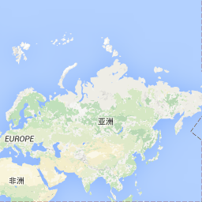
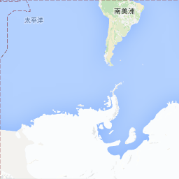
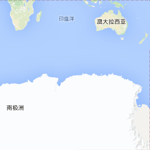

# LOD与分辨率
LOD是Levels of Detail的简写，用于根据当前的环境，渲染不同的图像，用于降低非重要的细节度，从而提高渲染效率，在电子游戏中经常运用，对于需要显示全球地图的`GIS`系统而言，更需要应用这项技术。在[万能瓦片地图加载秘籍](../ch05/05-03.md)中，有简单的说明。 在不同的细节层次下，自然分辨率就可能不一样，这两者是紧密结合在一起的。 对于图形显示系统而言，分辨率作为屏幕坐标和世界坐标之间计算的纽带，其作用是非常重要的。 本章节将以实例的方式深入浅出的讲解这两个重要的概念，及在OpenLayers 3中的应用。

<!-- more -->

# LOD原理
在详细讲解之前，假设给你两张A4纸，在其中一张纸上把你家整个绘制上去，在另一张纸上只把你睡的房间绘制上去。如果别人想看你家，你会给哪一张纸？如果想看你睡的房间，你会给哪一张纸？ 相信你不会给错，`LOD`就是这种根据不同需要，采用不同图的技术方案。在地图应用中，最直观的体验，就是地图放大缩小。当地图放大后，能看到更详细的地理信息，比如街道，商店等等。当地图缩小再缩小，原来能看到的街道，商店就看不见了，当能看到更大的区域，我们的屏幕就相当于是A4纸，大小不变。 

`LOD`这个技术方案非常棒，非常符合我们的自然习惯，所以在很多图形系统中都使用了这项技术。在GIS系统中，不断放大，就能看到更多地图细节，了解更加详细的信息。对于`GIS`引擎的开发者而言，需要实现这项技术，当发现用户放大地图时，就立马使用更有细节的地图图片，替换现在显示的地图图片。 现在问题来了：意思是说对于同一个地点而言，需要有很多张呈现不同细节程度的图片？是的，你没有猜错，虽然在使用地图的过程中，感觉放大缩小地图是浑然一体的，但其实就在你眼皮下发生了图片替换。 不同层级使用具有不同细节的地图图片，这就需要为每一个层级准备图片，如果使用离线工具下载瓦片地图，会看到下载的图片是按照层级Z进行存储的。开发者不用担心数据源的处理，只需要知道这个原理就可以了。

为了便于理解GIS系统中不同层级，使用不同的图片，下面使用google在线瓦片地图进行说明。 最小层级0情况下，只用了一张256*256像素的图片表示整个地球平面：


稍大一个层级1情况下，用了四张256*256像素的图片来表示整个地球：




对照一下，是否更加的明白了LOD原理及在GIS中的应用？

# 瓦片计算
不同环境条件下，加载具有不同细节的图片资源，可以提高效率，但这并不是终点。 瓦片技术可以更进一步提高效率。 其原理是将一张大图片切割成很多张小图片，按照呈现需要，加载其中的几张小图片即可。 为什么这样就能提高效率？因为屏幕显示窗口的大小是固定，比如屏幕分辨率是800\*600，或者1024\*768，又或者是1920\*800等等。如果屏幕分辨率是800\*600，一张大图是9000\*9000，那么同一时间，你只能看到这张图片的十分之一。 但是在不切片的情况下，你却必须要加载整个地图。 如果是在本地浏览还好，假如是发布在网络上，则网络传输和渲染，都将耗时。如果我们按照500\*500大小进行切片，我们则只需要加载4张500\*500的小图片就可以了。 对于`WebGIS`而言，需要在网络上发布，同时需要显示整个地球，自然需要使用瓦片技术。

## 切片方式
如果对整个地球图片进行切片，需要考虑的是整个地球图片大小，以及切片规则，切片大小。 对于`WebGIS`而言，在线地图几乎都采用墨卡托投影坐标系(Mercator)，对应的地图投影到平面上就是一个正方形。 为了方便使用，切片时大多按照正方形的方式来进行切片，比如切片大小为256\*256。一个1024\*1024的地图，就可以切成4张小的瓦片。 同时，瓦片大小几乎都是256\*256，有一些则会增加到512\*512。

LOD会使得不同层级下的全球地图大小不一致，结合瓦片技术一起，就出现了金字塔瓦片。 参见[万能瓦片地图加载秘籍](../ch05/05-03.md)里面的图。 在`WebGIS`中，上一层级的一张瓦片，在更大一层级中，会用4张瓦片来表示，依次类推，比如上一节中看到的Google在线瓦片地图的第0级和第1级的瓦片地图。 这样做可以维持正方形的投影方式不变，同时按照2的幂次方放大，计算效率非常高。

## 计算
通过上面切片的介绍，我们可以对每一层级瓦片的数量进行简单的计算。 层级0的瓦片数是$$1=2^0*2^0$$， 层级1的瓦片数是$$4=2^1*2^1$$，层级n的瓦片数是$$2^n*2^n$$。 这个地方计算的是所有瓦片数，因为是一个正方形，所以是边长的平方，如只计算x轴或者y轴一边的瓦片数，就是$$2^n$$个。

## 瓦片坐标
任意一个层级的地图，切成多个瓦片后，我们需要给瓦片编号，才能通过编号找到瓦片。这个问题在这就涉及到坐标系，在[万能瓦片地图加载秘籍](../ch05/05-03.md)里我们提到过，不同的在线地图服务商，可能定义不一样的瓦片坐标系，坐标系不一样，那么对应的同一个位置的瓦片的坐标也会不一样。 需要引起重视。

在OpenLayers 3提供了一个用于调试瓦片的`source`: `ol.source.TileDebug`。可以清晰的看到每一个瓦片的坐标：

<head>                  
	<link href="../src/ol3.13.1/ol.css" rel="stylesheet" type="text/css" />
	<script type="text/javascript" src="../src/ol3.13.1/ol.js" charset="utf-8"></script>
</head>
<div id="map" style="width: 100%"></div>
<script type="text/javascript">
	var osmSource = new ol.source.OSM();
	var map = new ol.Map({
	layers: [
	  new ol.layer.Tile({
	    source: osmSource
	  }),
	  new ol.layer.Tile({
	    source: new ol.source.TileDebug({
	      projection: 'EPSG:3857',
	      tileGrid: osmSource.getTileGrid()
	    })
	  })
	],
	target: 'map',
	view: new ol.View({
	  center: ol.proj.transform(
	      [104, 30], 'EPSG:4326', 'EPSG:3857'),
	  zoom: 10
	})
});
</script>

代码如下：

```html
<div id="map" style="width: 100%"></div>
<script type="text/javascript">
	var osmSource = new ol.source.OSM();
	var map = new ol.Map({
	layers: [
		// 加载Open Street Map地图
	  new ol.layer.Tile({
	    source: osmSource
	  }),
	  // 添加一个显示Open Street Map地图瓦片网格的图层
	  new ol.layer.Tile({
	    source: new ol.source.TileDebug({
	      projection: 'EPSG:3857',
	      tileGrid: osmSource.getTileGrid()
	    })
	  })
	],
	target: 'map',
	view: new ol.View({
	  center: ol.proj.transform(
	      [104, 30], 'EPSG:4326', 'EPSG:3857'),
	  zoom: 10
	})
});
</script>
```
首先从上图可以看到地图上多了网格，每一个网格对应的就是一个瓦片。 其次网格中有三个数字，这些数字就表示当前瓦片的坐标，第一个数字是层级z，第二个数字是表示经度方向上的x，第三个数字是表示维度方向上的y。 同样的，可以采用上面的方式来看看在[万能瓦片地图加载秘籍](../ch05/05-03.md)中提到的各种瓦片地图的瓦片坐标。


# 分辨率

前面简单提到过，分辨率是屏幕坐标和世界坐标的纽带，通过它，才能知道你在屏幕上用鼠标点击的位置对应于世界地图具体的经纬度位置。 当然你不用自己来做这个计算，OpenLayers 3的`ol.Map`已提供了对应的方法`getCoordinateFromPixel`来帮助你实现坐标转换。 你可能经常使用这个函数，但却不知道背后是怎样的一个原理，本小节将理清其中的来龙去脉。

上一节说到了每一个层级，会使用不同的瓦片数来表示整个地球，那么无论是哪一个层级，所表示的实际地理空间范围都是一致的。但使用的瓦片个数却是不一样的，以Google在线地图为例，层级0使用了一个瓦片，层级1使用了4个瓦片。 通过计算可以知道层级0整个地球图像为$$256*256$$像素大小，层级1整个地球图像为$$512*512$$像素大小。 层级0和层级1表示的地球范围都是一样的经度[-180, 180]，纬度[-90, 90]。 在层级0的时候，一个像素就表示$$\frac{360}{256} = 1.40625$$这么长的经度范围，$$\frac{180}{256}=0.703125$$这么长的纬度范围。 而这两个数字就是分辨率了，即一个像素所表达的范围是多少，这个范围可能是度，可能是米，或者其他单位，根据具体的情况而定。

## 墨卡托投影坐标系下的分辨率
我们知道，在`WebGis`中使用的在线瓦片地图是采用的墨卡托(Mercator)投影坐标系，经过投影后，整个地球是一个正方形，所能表示的地球范围为经度[-180, 180]，纬度[-85, 85]，单位为度。 对应的墨卡托坐标系的范围x[-20037508.3427892, 20037508.3427892]，范围y同样是[-20037508.3427892, 20037508.3427892]，单位为m。 或许你会好奇这个范围是怎么计算而来的，如果详细了解过它的定义，应该知道墨卡托只是简单的把地球球面剖开拉伸为一个正方形而来，由于南北极两端采用这种拉伸会严重变形，并且南北极在使用过程中很少用到，所以干脆就只投影了[-85, 85]纬度范围的地球。 而展开时，因为纬度范围有缩减，所以肯定只能以经度来展开，即在经度-180度的地方从上到下剖开地球，然后按照赤道方向来展开成一张平面，那么这个平面的长，就等于以地球赤道半径按照圆来计算的周长。 近似的按照6378137米为半径来计算，那么整个赤道周长的一半，即为
> $$\pi*r=3.1415926*6378137=20037508.0009862$$

以上就是墨卡托投影坐标系范围的完整的计算过程，墨卡托也有很多变形，会有细微的不同，OpenLayers 3默认使用的是EPSG:3857，对于该坐标系的详细定义，可以参见[epsg.io 3867](http://epsg.io/3857)。 

有了范围之后，要想计算分辨率，按照上面的计算过程就非常简单了，还是以Google在线瓦片地图为例，x方向上的分辨率计算公式可以归纳为：

> $$ resolution = \frac{rangeX}{256*2^{level}}$$

`rangeX`表示x方向上整个范围，比如 $$20037508.3427892 - (-20037508.3427892)$$，256表示的一个瓦片的宽度，单位为像素，$$2^{level}$$表示的在层级`level`下，x方向上的瓦片个数。 那么分母计算出来的结果就是在层级level下，整个地图在x方向上的宽度，单位为像素。 那么整个公式计算出来就是在x方向上一个像素所能代表的实际地理范围，即分辨率。

## OpenLayers默认使用的分辨率

<head>                  
	<link href="../src/ol3.13.1/ol.css" rel="stylesheet" type="text/css" />
	<script type="text/javascript" src="../src/ol3.13.1/ol.js" charset="utf-8"></script>
</head>
<div id="map" style="width: 100%"></div>
<div><span>当前层级：</span><span id="zoom"></span><span>分辨率：</span><span id="resolution"></span></div>
<script type="text/javascript">
	var map = new ol.Map({
		layers: [
		  new ol.layer.Tile({
		    source: new ol.source.OSM()
		  })
		],
		target: 'map',
		view: new ol.View({
		  center: ol.proj.transform(
		      [104, 30], 'EPSG:4326', 'EPSG:3857'),
		  zoom: 10
		})
	});

	map.getView().on('change:resolution', function(){
		document.getElementById('zoom').innerHTML =  this.getZoom() + '，';
		document.getElementById('resolution').innerHTML = this.getResolution();
	})

	document.getElementById('zoom').innerHTML = map.getView().getZoom() + '，';
	document.getElementById('resolution').innerHTML = + map.getView().getResolution();
</script>

代码如下：
```html
<div id="map" style="width: 100%"></div>
<div><span>当前层级：</span><span id="zoom"></span><span>分辨率：</span><span id="resolution"></span></div>
<script type="text/javascript">
	var map = new ol.Map({
		layers: [
		  new ol.layer.Tile({
		    source: new ol.source.OSM()
		  })
		],
		target: 'map',
		view: new ol.View({
		  center: ol.proj.transform(
		      [104, 30], 'EPSG:4326', 'EPSG:3857'),
		  zoom: 10
		})
	});

	// 监听层级变化，输出当前层级和分辨率
	map.getView().on('change:resolution', function(){
		document.getElementById('zoom').innerHTML =  this.getZoom() + '，';
		document.getElementById('resolution').innerHTML = this.getResolution();
	})

	document.getElementById('zoom').innerHTML = map.getView().getZoom() + '，';
	document.getElementById('resolution').innerHTML = + map.getView().getResolution();
</script>
```
缩放上面的地图，从层级0开始，用前面介绍的公式和当前地图显示的分辨率进行比较，你会发现OpenLayers默认采用的分辨率和Google在线瓦片地图一样。

## 注意事项
为什么我们上面一直以Google在线瓦片地图举例说明？ 因为不同的在线瓦片地图可能采用不一样的分辨率，比如百度在线瓦片地图。 所以在使用在线瓦片地图或者自己制作的瓦片地图时，都需要知道使用的分辨率是多少。 如若不然，可能也会出现位置偏移。 


# 自定义瓦片地图及加载
 