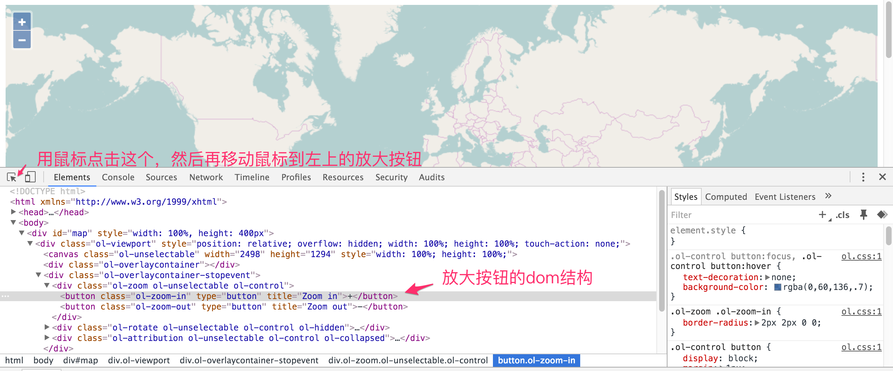

# Control
 在OpenLayers 3中，地图控件指的是下图标注的这些，包括缩放按钮，标尺，版权说明，指北针等等。 

<!-- more -->

 
 他们不会随着地图的移动而移动，一直处于一个固定的位置。 在实现上，并不是在画布上绘制的，而是使用传统的HTML元素来实现的，便于同地图分离，也便于界面实现。 在本章节中，将先概览OpenLayers 3中已有的地图控件，对其实现进行分析，在此基础上进一步修改其样式，从而定义自己的控件。

 # 控件概览
OpenLayers 3目前内置的地图控件类都在包`ol.control`下面，依次有：

* `ol.control.Attribution`: 右下角的地图信息控件
* `ol.control.FullScreen`: 全屏控件
* `ol.control.MousePosition`: 鼠标位置控件
* `ol.control.OverviewMap`: 鸟瞰图控件
* `ol.control.Rotate`: 指北针控件
* `ol.control.ScaleLine`: 比例尺控件
* `ol.control.Zoom`: 缩放按钮控件
* `ol.control.ZoomSlider`: 缩放滚动条控件
* `ol.control.ZoomToExtent`: 放大到设定区域控件

每一个类都有一些设置参数，可对照官网API的文档来了解其对应的功能。 

默认情况下，在地图上是不会显示这么多地图控件的，只会应用`ol.control.defaults()`这个函数返回的地图控件，默认包含了`ol.control.Zoom`，`ol.control.Rotate`和`ol.control.Attribution`这个控件。 其使用方式同`ol.interaction.defaults()`很像，同样可以设置一些参数来控制控件的一些功能，从而实现定制化需求。 比如下面这个地图上的控件稍微的同默认情况下的控件有点不一样，因为控件都不存在了。

<head>                  
	<link href="../src/ol3.13.1/ol.css" rel="stylesheet" type="text/css" />
	<script type="text/javascript" src="../src/ol3.13.1/ol.js" charset="utf-8"></script>
</head>
<div id="map" style="width: 100%"></div>
<script type="text/javascript">
	var map = new ol.Map({
		controls: ol.control.defaults({
			attribution: false,
			rotate: false,
			zoom: false
		}),
		layers: [
		  new ol.layer.Tile({
		    source: new ol.source.OSM()
		  })
		],
		target: 'map',
		view: new ol.View({
		  center: ol.proj.transform(
		      [104, 30], 'EPSG:4326', 'EPSG:3857'),
		  zoom: 10
		})
	});
</script>

代码如下：
```html
<head>                  
	<link href="../src/ol3.13.1/ol.css" rel="stylesheet" type="text/css" />
	<script type="text/javascript" src="../src/ol3.13.1/ol.js" charset="utf-8"></script>
</head>
<div id="map" style="width: 100%"></div>
<script type="text/javascript">
	var map = new ol.Map({
		// 设置地图控件，默认的三个控件都不显示
		controls: ol.control.defaults({
			attribution: false,
			rotate: false,
			zoom: false
		}),
		layers: [
		  new ol.layer.Tile({
		    source: new ol.source.OSM()
		  })
		],
		target: 'map',
		view: new ol.View({
		  center: ol.proj.transform(
		      [104, 30], 'EPSG:4326', 'EPSG:3857'),
		  zoom: 10
		})
	});
</script>
```
当然，上面这个代码有更简洁的写法: `controls: []`，上面只是演示`ol.control.defaults`方法的使用而已。 如果需要把所有控件都显示出来，那么可以这样：

<div id="map2" style="width: 100%"></div>
<script type="text/javascript">
	var map2 = new ol.Map({
		controls: ol.control.defaults().extend([
			new ol.control.FullScreen(),
			new ol.control.MousePosition(),
			new ol.control.OverviewMap(),
			new ol.control.ScaleLine(),
			new ol.control.ZoomSlider(),
			new ol.control.ZoomToExtent()
		]),
		layers: [
		  new ol.layer.Tile({
		    source: new ol.source.OSM()
		  })
		],
		target: 'map2',
		view: new ol.View({
		  center: ol.proj.transform(
		      [104, 30], 'EPSG:4326', 'EPSG:3857'),
		  zoom: 10
		})
	});
</script>

有些控件重叠在一起，得仔细分辨。 代码如下：

```html
<div id="map2" style="width: 100%"></div>
<script type="text/javascript">
	var map2 = new ol.Map({
		// 在默认控件的基础上，再加上其他内置的控件
		controls: ol.control.defaults().extend([
			new ol.control.FullScreen(),
			new ol.control.MousePosition(),
			new ol.control.OverviewMap(),
			new ol.control.ScaleLine(),
			new ol.control.ZoomSlider(),
			new ol.control.ZoomToExtent()
		]),
		layers: [
		  new ol.layer.Tile({
		    source: new ol.source.OSM()
		  })
		],
		target: 'map2',
		view: new ol.View({
		  center: ol.proj.transform(
		      [104, 30], 'EPSG:4326', 'EPSG:3857'),
		  zoom: 10
		})
	});
</script>
```
下图是一个界面控件和类的对照关系图：


每一个控件都有相应的参数设置，如果具体到某一个控件使用时，不能满足需求，可以先参照官网API说明，进行相应使用。

# 探究控件原理
在介绍后续的知识之前，先探究一下控件是如何做成的。 在chrome中打开一个最简单的地图例子，打开开发者工具面板，用工具栏最左边的元素选择器选择地图左上方的放大按钮，可以看到类似如下的界面：


上图可以看到放大按钮完整的dom结构图，从而一窥究竟，按钮原来就是简单的HTML的元素，结合`css`的效果做出来的，可以看到放大按钮的`css class`为`ol-zoom-in`，紧接着的就是缩小按钮的节点，其`css class`为`ol-zoom-out`，他们的父节点也有对应的`css class`： `ol-zoom`。 我们可以在`ol.css`文件中找到这些`class`的定义，设置了相应的样式。 控件`ui`的原理是清楚了，那么对应的控件要响应一些鼠标或者按键操作，应该也就是添加响应的事件监听器就可以了。

对于具体怎么做的，我们可以从控件`ol.control.Zoom`的部分源码来分析：

```javascript
	// 设定放大缩小按钮的提示信息
  var zoomInTipLabel = options.zoomInTipLabel !== undefined ?
      options.zoomInTipLabel : 'Zoom in';
  var zoomOutTipLabel = options.zoomOutTipLabel !== undefined ?
      options.zoomOutTipLabel : 'Zoom out';

  // 创建放大按钮的dom节点
  var inElement = goog.dom.createDom('BUTTON', {
    'class': className + '-in',
    'type' : 'button',
    'title': zoomInTipLabel
  }, zoomInLabel);

  // 并绑定鼠标点击事件的处理函数 handleClick_
  ol.events.listen(inElement,
      ol.events.EventType.CLICK, goog.partial(
          ol.control.Zoom.prototype.handleClick_, delta), this);

  ......

  // 函数定义如下
  /**
	 * @param {number} delta Zoom delta.
	 * @param {Event} event The event to handle
	 * @private
	 */
	ol.control.Zoom.prototype.handleClick_ = function(delta, event) {
	  event.preventDefault(); // 阻止事件传递到下面的map
	  this.zoomByDelta_(delta);	// 调用具体的方法进行放大
	};
```
这个过程和我们平时的在界面上添加一个节点，再绑定事件处理函数，并没有什么差别，其他类似的控件也是一样的原理。这对我们来说，想改变`ui`样式，是非常容易的事，甚至可以改变它的默认行为。


# 控件美颜
在知道原理后，想对控件美颜就是一件非常容易的事，大致有下面两种方式：

## 自定义CSS样式
知道控件的实现原理后，美颜就变得非常简单了，找到对应的`class`，设置`css`样式，就轻松搞定，这完全就是`css`范畴的内容了，比如你可以做到下面这样：
<head>                  
	<link href="../src/ol3.13.1/ol.css" rel="stylesheet" type="text/css" />
	<link rel="stylesheet" type="text/css" href="../src/css/extend.css" />
	<script type="text/javascript" src="../src/ol3.13.1/ol.js" charset="utf-8"></script>
</head>
<div id="map" style="width: 100%"></div>
<script type="text/javascript">
	var map = new ol.Map({
		layers: [
		  new ol.layer.Tile({
		    source: new ol.source.OSM()
		  })
		],
		target: 'map',
		view: new ol.View({
		  center: ol.proj.transform(
		      [104, 30], 'EPSG:4326', 'EPSG:3857'),
		  zoom: 10
		})
	});
</script>

代码只涉及`css`代码，如下：
```css
.ol-zoom .ol-zoom-in {
	background-color: #0000ff;
	color: #ff0000;
}
```
这段代码可以放在单独的`css`文件里面，也可以直接加载`<head></head>`里面，但必须是在`ol.css`引入之后加，这样才能覆盖`ol3`默认的`css`样式。 最简单粗暴的，莫过于直接在`ol.css`里面修改，但这样侵入性太强，不利于`OpenLayers 3`的版本升级，升级一次，就得自己修改一次。 所以不推荐。

其他控件的`css`样式修改同上，此处不再累述，请自行修改验证。

## JavaScript修改
在前端除了`css`之外，还可以用强大的`javascript`代码进行修改，比如像下面这样，把最大化按钮的图标改变一下：

<head>                  
	<script type="text/javascript" src="../src/js/zepto.min.js" charset="utf-8"></script>
</head>
<div id="map2" style="width: 100%"></div>
<script type="text/javascript">
	new ol.Map({
		layers: [
		  new ol.layer.Tile({
		    source: new ol.source.OSM()
		  })
		],
		target: 'map2',
		view: new ol.View({
		  center: ol.proj.transform(
		      [104, 30], 'EPSG:4326', 'EPSG:3857'),
		  zoom: 10
		})
	});

	$('#map2 .ol-zoom-in').html('<>');
</script>

代码如下：
```html
<div id="map2" style="width: 100%"></div>
<script type="text/javascript">
	new ol.Map({
		layers: [
		  new ol.layer.Tile({
		    source: new ol.source.OSM()
		  })
		],
		target: 'map2',
		view: new ol.View({
		  center: ol.proj.transform(
		      [104, 30], 'EPSG:4326', 'EPSG:3857'),
		  zoom: 10
		})
	});

	// 设置放大按钮符号，下面这个代码需要引入jquery，或者zepto库
	$('#map2 .ol-zoom-in').html('<>');
</script>
```

使用`javascript`代码势必能更进一步定制各种控件。

# 自定义控件
有了前面的基础介绍，自定义控件就变得相对简单了，共分为两个步骤，第一步是构建界面，第二步是用代码实现功能。 下面自定义了一个分享当前地图的功能：

<head>                  
	<link href="../src/ol3.13.1/ol.css" rel="stylesheet" type="text/css" />
	<link rel="stylesheet" type="text/css" href="../src/css/share.css" />
	<script type="text/javascript" src="../src/js/zepto.min.js" charset="utf-8"></script>
	<script type="text/javascript" src="../src/ol3.13.1/ol.js" charset="utf-8"></script>
</head>
<div id="map" style="width: 100%"></div>
<script type="text/javascript">
	var map = new ol.Map({
		layers: [
		  new ol.layer.Tile({
		    source: new ol.source.OSM()
		  })
		],
		target: 'map',
		view: new ol.View({
		  center: ol.proj.transform(
		      [104, 30], 'EPSG:4326', 'EPSG:3857'),
		  zoom: 10
		})
	});

	var viewport = map.getViewport();
	$(viewport).append('<div id="share" class="share">分享地图</div>');

	document.getElementById('share').onclick = function() {
		alert('分享当前地图给朋友');
	}
</script>

对应的代码如下：

```html
<div id="map" style="width: 100%"></div>
<script type="text/javascript">
	var map = new ol.Map({
		layers: [
		  new ol.layer.Tile({
		    source: new ol.source.OSM()
		  })
		],
		target: 'map',
		view: new ol.View({
		  center: ol.proj.transform(
		      [104, 30], 'EPSG:4326', 'EPSG:3857'),
		  zoom: 10
		})
	});

	// 在viewport节点下添加一个分享按钮
	var viewport = map.getViewport();
	$(viewport).append('<div id="share" class="share">分享地图</div>');

	// 监听按钮点击事件，执行相关操作
	document.getElementById('share').onclick = function() {
		alert('分享当前地图给朋友');
	}
</script>
```
结合注释理解代码，对于分享按钮的外观都是由`css`来定义：
```css
.share {
	position: absolute;
	top: 10px;
	right: 10px;
	border: 1px;
	border-color: #333;
	background-color: #339999;
	color: #fff;
	box-shadow: 0px 0px 2px #666;
	cursor: pointer;
	padding: 0 4px 0 4px;
}
```
由此可见，自定义控件也是一件非常简单的事。