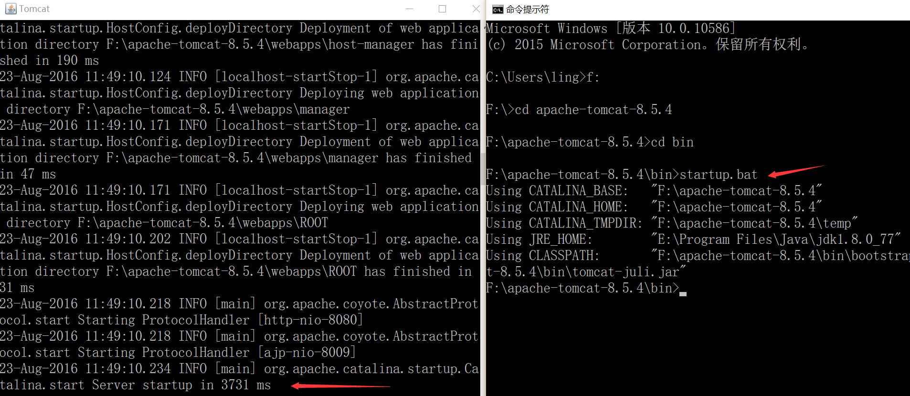
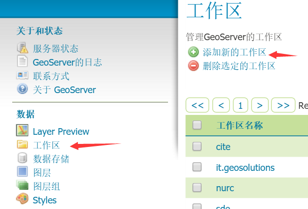

# 进阶实例

前面的基础知识，用于应对基本应用没有问题，但如果想更进一步的结合在一起应用，或者解决更为复杂一点的问题，则稍显困难。本章节针对这类问题给出一些实例讲解，以解决广大ol3使用者的困惑，用于感谢大家对本教程的支持。针对这类问题，曾经在Openlayer3 QQ群里面收集统计过，下面的例子就是基于这些统计数据分析讨论而出的。如果你有什么其他的想法或意见，请在下方留言或QQ联系我（11364382），谢谢。

<!-- more -->

# 通过wfs增删改查要素

本节将讲解ol3使用wfs同后台geoserver进行交互，从而实现要素的增删改查。由于geoserver需要服务器端，所以我们将从环境搭建开始讲解，使用公开的数据源，进行查询，修改，添加，删除操作的演示，使得大家最终学会。

# 在windows环境下配置GeoServer

由于wfs协议涉及到跨域的问题，在配置过程中，我们也将把跨域的环境配置好。虽然跨域的解决方式有很多，但此处选择一个稍微简单的方式，详见下面的具体步骤。

## 安装Java环境
我们使用tomcat作为服务器，所以需要java环境，如果你不确定是否安装有java环境，则可以在命令终端执行： `java -version`，比如我的环境：


如果提示`java`命令找不到的错误，说明你得优先安装java环境，请到[官网](http://www.java.com/zh_CN/)下载最新的Java进行安装。
 
## 下载Tomcat
安装好java环境后，我们就到[Tomcat官网](http://tomcat.apache.org/)下载Tomcat，如果java环境是64位的，记得下载64位的Tomcat，如果是32位的java环境，就需要下载32位的tomcat。如上图所示，我的是64位java环境，我选择下载8.5.4版本，64位的windows环境的tomcat： [apache-tomcat-8.5.4-windows-x64.zip](https://mirrors.tuna.tsinghua.edu.cn/apache/tomcat/tomcat-8/v8.5.4/bin/apache-tomcat-8.5.4-windows-x64.zip)。

下载后，解压到一个指定的目录， 我放在了`F:\apache-tomcat-8.5.4`。记住，解压就可以了，免安装，此时需要验证一下是否能正常启动Tomcat，启动命令终端，执行tomcat目录下的`bin\startup.bat`，如下：


从上图可以发现，我们还没有配置环境变量`JAVA_HOME`或者`JRE_HOME`。那么我先配置一个`JAVA_HOME`的环境变量，配置好后，记得注销或者重启电脑，让环境变量生效。 然后重新执行命令，正确启动如下：


成功启动会弹出一个新的`tomcat`命令行窗口，参见上图左边的命令行窗口。

## 安装GeoServer
此时，我们需要到[GeoServer官网](http://geoserver.org/)去下载geoserver，我选择了最新的2.9.1版本，由于我使用tomcat作为服务器，所以我选择下载`Web Archive`格式的[geoserver-2.9.1-war.zip](https://sourceforge.net/projects/geoserver/files/GeoServer/2.9.1/geoserver-2.9.1-war.zip/download)。

下载后解压到得到war文件：`geoserver.war`，把该文件放置到tomcat目录下的webapps目录下，比如放置该文件后，我的路径为：`F:\apache-tomcat-8.5.4\webapps\geoserver.war`。

然后在命令行终端启动tomcat，可能需要稍微等待一下，因为要部署geoserver，待tomcat命令行终端启动完成，就可以打开浏览器输入`http://localhost:8080/geoserver`打开geoserver的管理页面，如下：


见到这个页面，也就安装成功了。如果没有出现该页面，请按照前面的步骤检查一下什么地方出问题了。

## 跨域配置
由于tomcat从7.0.41版本开始就支持跨域了，参见[CORS on Tomcat](http://enable-cors.org/server_tomcat.html)，我们下载的tomcat是8.5.4，自然就能很好的支持了，只需要进行下面的简单配置：
* 找到geoserver的`web.xml`文件，我的电脑对应的路径为`F:\apache-tomcat-8.5.4\webapps\geoserver\WEB-INF\web.xml`
* 打开该文件，把下面的配置添加在该文件中：
  ```
    <filter>
	  <filter-name>CorsFilter</filter-name>
	  <filter-class>org.apache.catalina.filters.CorsFilter</filter-class>
	</filter>
	<filter-mapping>
	  <filter-name>CorsFilter</filter-name>
	  <url-pattern>/*</url-pattern>
	</filter-mapping>
  ```
  


然后再重新启动tomcat即可。


# 配置数据源

为了后续进行wfs的各项使用演示，我就使用geoserver官方中使用的数据[nyc_roads.zip](http://docs.geoserver.org/latest/en/user/_downloads/nyc_roads.zip)。这份数据的配置，官网也提供了指导，参见[Publishing a shapefile](http://docs.geoserver.org/latest/en/user/gettingstarted/shapefile-quickstart/index.html)。

下面就以我的计算机配置为例，进行说明：

1. 下载后解压，把压缩包里面的`nyc_roads.dbf, nyc_roads.prj, nyc_roads.shp, nyc_roads.shx`放在目录`F:\apache-tomcat-8.5.4\webapps\geoserver\data\data\nyc_roads`下，`nyc_roads`这个目录没有，就新建一个。

2. 启动tomcat，在浏览器中打开geoserver的配置页面`http://localhost:8080/geoserver`，使用用户admin登录，密码为geoserver。

3. 创建`工作区`：




4. 创建`数据存储`：


5. 创建`图层`，数据源配置好后，保存，就出现下面这个界面：


点击`发布`创建新图层：


最后点击页面最下方的`保存`按钮，就配置好了。

6. 最后预览一下，点击左边的`Layer Preview`，在右边找到刚才创建的图层`nyc_roads:nyc_roads`，点击右边的OpenLayers，就可以打开新页面，显示预览结果。


出现最后一个页面，就说明数据源配置好了。 


# 通过wfs查询要素

一切都准备好了，现在终于可以通过ol3加载配置好的数据了。上一节中最后的预览结果，大家已经看到了，此处我们自己通过ol3来实现这个预览页面，效果图如下：


对应的代码如下：
```html
<html>

<head>
  <title>wfs demo</title>
  <link rel="stylesheet" href="../ol3.15.1/ol.css" type="text/css" />
  <script src="../ol3.17.1/ol-debug.js" type="text/javascript" charset="utf-8"></script>
</head>

<body>

  <div id="map" style="width:100%;height:100%;"></div>

  <script>
    var vector = new ol.layer.Vector({
      source: new ol.source.Vector({
        format: new ol.format.GeoJSON(),
        url: 'http://localhost:8080/geoserver/wfs?service=wfs&version=1.1.0&request=GetFeature&typeNames=nyc_roads:nyc_roads&outputFormat=application/json&srsname=EPSG:4326'
      }),
      style: function(feature, resolution) {
        return new ol.style.Style({
          stroke: new ol.style.Stroke({
            color: 'blue',
            width: 1
          })
        });
      }
    });

    var map = new ol.Map({
      layers: [new ol.layer.Tile({
        source: new ol.source.OSM()
      }), vector],
      target: 'map',
      view: new ol.View({
        center: [-73.99710639567148, 40.742270050255556],
        maxZoom: 19,
        zoom: 14,
        projection: 'EPSG:4326'
      })
    });
  </script>

</body>

</html>
```

和一般的矢量地图加载没什么两样，对于wfs而言，需要弄明白的是`ol.source.Vector`的`url`参数： `http://localhost:8080/geoserver/wfs?service=wfs&version=1.1.0&request=GetFeature&typeNames=nyc_roads:nyc_roads&outputFormat=application/json&srsname=EPSG:4326`。 如果对wfs协议不太清楚的，建议优先看一下geoserver的官网文档[WFS](http://docs.geoserver.org/stable/en/user/services/wfs/index.html)。 

此处我们要获取所有的要素，所以设置`request=GetFeature`，`typeNames`的值设置为`nyc_roads:nyc_roads`，是因为我们之前配置的图层命名如此，可以在geoserver管理页面的`Layer Preview`里面看对应图层的`Name`。 对于`outputFormat`和`srsname`就不做过多解释，大家看值就容易明白了。因为`view`设置的`projection: 'EPSG:4326'`，所以此处设置`srsname=EPSG:4326`。

BTW: 上面是全部查询，我们知道wfs也支持filter，所以我们可以在`url`里面设置filter，从而实现更细粒度的查询，比如这样：`http://localhost:8080/geoserver/wfs?service=wfs&version=1.1.0&request=GetFeature&typeNames=nyc_roads:nyc_roads&outputFormat=application/json&srsname=EPSG:4326&cql_filter=in ('nyc_roads.1162')`。 大家可以自行用这个url进行测试一下。关于filter更详细的信息参见[Supported filter languages](http://docs.geoserver.org/latest/en/user/filter/syntax.html)。 因为这不是教程的重点，所以此处不进行细说。

# 通过wfs修改要素

在查询的基础上，本小节我们更进一步对界面上呈现的要素进行修改，然后通过wfs协议保存到服务器端。界面效果如下:


在界面上方，先点击`查询`按钮，通过wfs协议把所有的要素查询到前端界面上显示，然后选择复选框`编辑`，就可以选择界面上的线段，进行编辑，比如把直线编辑成`W`形状，然后点击按钮`保存`，就可以把编辑后的线段保存下来。

在点击`保存`按钮之前，请打开开发者面板，然后再点击`保存`，之后就可以看到发起了一个wfs的http请求到geoserver服务器，请求的url为：`http://localhost:8080/geoserver/wfs?service=wfs`，发送的内容大致为: 
```
<Transaction xmlns="http://www.opengis.net/wfs" service="WFS" version="1.1.0" xmlns:xsi="http://www.w3.org/2001/XMLSchema-instance" xsi:schemaLocation="http://www.opengis.net/wfs http://schemas.opengis.net/wfs/1.1.0/wfs.xsd">
  <Update typeName="feature:nyc_roads" xmlns:feature="http://geoserver.org/nyc_roads">
    <Property>
      <Name>the_geom</Name>
      <Value>
        <MultiLineString xmlns="http://www.opengis.net/gml" srsName="EPSG:4326">
          <lineStringMember>
            <LineString srsName="EPSG:4326">
              <posList>-73.98528635501862 40.768332481384284 -73.98608637 40.76719342 -73.98449242115021 40.767849683761604 -73.98447096347809 40.76647639274598 -73.98299038410187 40.767334699630744 -73.98336657 40.76604531</posList>
            </LineString>
          </lineStringMember>
        </MultiLineString>
      </Value>
    </Property>
    <Property>
      <Name>modified</Name>
      <Value>5/28/2001</Value>
    </Property>
    <Property>
      <Name>name</Name>
      <Value>W 56 ST</Value>
    </Property>
    <Property>
      <Name>vsam</Name>
      <Value>15060</Value>
    </Property>
    <Property>
      <Name>sourcedate</Name>
      <Value>3/31/1996</Value>
    </Property>
    <Property>
      <Name>sourcetype</Name>
      <Value>Photogrammetric</Value>
    </Property>
    <Property>
      <Name>source_id</Name>
      <Value>96083</Value>
    </Property>
    <Property>
      <Name>borough</Name>
      <Value>Manhattan</Value>
    </Property>
    <Property>
      <Name>feat_code</Name>
      <Value>2900</Value>
    </Property>
    <Property>
      <Name>feat_desc</Name>
      <Value>Paved Road</Value>
    </Property>
    <Property>
      <Name>exported</Name>
      <Value>05/19/2004</Value>
    </Property>
    <Property>
      <Name>feat_type</Name>
      <Value>0</Value>
    </Property>
    <Filter xmlns="http://www.opengis.net/ogc">
      <FeatureId fid="nyc_roads.882" />
    </Filter>
  </Update>
</Transaction>
```
如果保存成功，则`response`的内容大致如下：
```
<?xml version="1.0" encoding="UTF-8"?>
<wfs:TransactionResponse 
  xmlns:xs="http://www.w3.org/2001/XMLSchema" 
  xmlns:sf="http://www.openplans.org/spearfish" 
  xmlns:wfs="http://www.opengis.net/wfs" 
  xmlns:gml="http://www.opengis.net/gml" 
  xmlns:nyc_roads="http://geoserver.org/nyc_roads" 
  xmlns:ogc="http://www.opengis.net/ogc" 
  xmlns:ows="http://www.opengis.net/ows" 
  xmlns:tiger="http://www.census.gov" 
  xmlns:topp="http://www.openplans.org/topp" 
  xmlns:xlink="http://www.w3.org/1999/xlink" x
  mlns:xsi="http://www.w3.org/2001/XMLSchema-instance" 
  version="1.1.0" 
  xsi:schemaLocation="http://www.opengis.net/wfs http://localhost:8080/geoserver/schemas/wfs/1.1.0/wfs.xsd">

  <wfs:TransactionSummary>
    <wfs:totalInserted>0</wfs:totalInserted>
    <wfs:totalUpdated>1</wfs:totalUpdated>
    <wfs:totalDeleted>0</wfs:totalDeleted>
  </wfs:TransactionSummary>
  <wfs:TransactionResults/>
  <wfs:InsertResults>
    <wfs:Feature><ogc:FeatureId fid="none"/></wfs:Feature>
  </wfs:InsertResults>
</wfs:TransactionResponse>
```
重新刷新页面后，再次点击`查询`按钮，可以验证之前修改的线段是否修改成功。由于不能提供geoserver服务器，所以只能让大家自行用下面的代码在本地验证：

```html
<html>

<head>
  <title>wfs modify demo</title>
  <link rel="stylesheet" href="../ol3.17.1/ol.css" type="text/css" />
  <script src="../ol3.17.1/ol-debug.js" type="text/javascript" charset="utf-8"></script>
  <script src="../3rdparty/zepto.min.js" type="text/javascript" charset="utf-8"></script>
</head>

<body>
  <input type="button" value="查询" onclick="queryWfs();" />
  <input id="select" type="checkbox" value="select" />选择
  <input id="modify" type="checkbox" value="modify" />编辑
  <input id="save" type="button" value="保存" onclick="onSave();" />

  <div id="map" style="width:100%;height:100%;"></div>

  <script>
    var wfsVectorLayer = null;
    var modifiedFeatures = null;

    // 选择器
    var selectInteraction = new ol.interaction.Select({
      style: new ol.style.Style({
        stroke: new ol.style.Stroke({
          color: 'red',
          width: 2
        })
      })
    });

    // 修改器
    var modifyInteraction = new ol.interaction.Modify({
      style: new ol.style.Style({
        stroke: new ol.style.Stroke({
          color: 'red',
          width: 5
        })
      }),
      features: selectInteraction.getFeatures()
    });
    modifyInteraction.on('modifyend', function(e) {
      // 把修改完成的feature暂存起来
      modifiedFeatures = e.features;
    });

    var map = new ol.Map({
      layers: [new ol.layer.Tile({
        source: new ol.source.OSM()
      })],
      target: 'map',
      view: new ol.View({
        center: [-73.99710639567148, 40.742270050255556],
        maxZoom: 19,
        zoom: 13,
        projection: 'EPSG:4326'
      })
    });

    // 通过wfs查询所有的要素
    function queryWfs() {
      // 支持重新查询
      if (wfsVectorLayer) {
        map.removeLayer(wfsVectorLayer);
      }
      
      // 创建新的图层来加载wfs的要素
      wfsVectorLayer = new ol.layer.Vector({
        source: new ol.source.Vector({
          format: new ol.format.GeoJSON({
            geometryName: 'the_geom' // 因为数据源里面字段the_geom存储的是geometry，所以需要指定
          }),
          url: 'http://localhost:8080/geoserver/wfs?service=wfs&version=1.1.0&request=GetFeature&typeNames=nyc_roads:nyc_roads&outputFormat=application/json&srsname=EPSG:4326'
        }),
        style: function(feature, resolution) {
          return new ol.style.Style({
            stroke: new ol.style.Stroke({
              color: 'blue',
              width: 5
            })
          });
        }
      });
      map.addLayer(wfsVectorLayer);
    }
    
    $('#select').change(function() {
      if (this.checked) {
        // 勾选选择复选框时，添加选择器到地图
        map.removeInteraction(selectInteraction);
        map.addInteraction(selectInteraction);
      } else {
        // 不勾选选择复选框的情况下，移出选择器和修改器
        map.removeInteraction(selectInteraction);
        document.getElementById('modify').checked = false;
        map.removeInteraction(modifyInteraction);
        modifiedFeatures = null;
      }
    });

    $('#modify').change(function() {
      if (this.checked) {
        // 勾选修改复选框时，添加选择器和修改器到地图
        document.getElementById('select').checked = true;
        map.removeInteraction(modifyInteraction);
        map.addInteraction(modifyInteraction);
        map.removeInteraction(selectInteraction);
        map.addInteraction(selectInteraction);
      } else {
        // 不勾选修改复选框时，移出修改器
        map.removeInteraction(modifyInteraction);
        modifiedFeatures = null;
      }
    });
    
    // 保存已经编辑的要素
    function onSave() {
      if (modifiedFeatures && modifiedFeatures.getLength() > 0) {

        // 转换坐标
        var modifiedFeature = modifiedFeatures.item(0).clone();
        // 注意ID是必须，通过ID才能找到对应修改的feature
        modifiedFeature.setId(modifiedFeatures.item(0).getId());
        // 调换经纬度坐标，以符合wfs协议中经纬度的位置
        modifiedFeature.getGeometry().applyTransform(function(flatCoordinates, flatCoordinates2, stride) {
          for (var j = 0; j < flatCoordinates.length; j += stride) {
            var y = flatCoordinates[j];
            var x = flatCoordinates[j + 1];
            flatCoordinates[j] = x;
            flatCoordinates[j + 1] = y;
          }
        });
        modifyWfs([modifiedFeature]);
      }
    }
    
    // 把修改提交到服务器端
    function modifyWfs(features) {
      var WFSTSerializer = new ol.format.WFS();
      var featObject = WFSTSerializer.writeTransaction(null,
        features, null, {
          featureType: 'nyc_roads', 
          featureNS: 'http://geoserver.org/nyc_roads',  // 注意这个值必须为创建工作区时的命名空间URI
          srsName: 'EPSG:4326'
        });
      // 转换为xml内容发送到服务器端
      var serializer = new XMLSerializer();
      var featString = serializer.serializeToString(featObject);
      var request = new XMLHttpRequest();
      request.open('POST', 'http://localhost:8080/geoserver/wfs?service=wfs');
      // 指定内容为xml类型
      request.setRequestHeader('Content-Type', 'text/xml');
      request.send(featString);
    }
  </script>

</body>

</html>
```

# 通过wfs添加要素

现在我们该介绍一下如何在前端绘制一个新的要素，并且保存到服务器端。还是先看一下界面：


勾选`新增`复选框之后，就可以在界面上绘制新的线段，如图，绘制了一个`W`形状的线，绘制完成后，点击按钮`保存`就可以把界面上新增的线保存到服务器端，在开发者工具界面可以看到http请求: `http://localhost:8080/geoserver/wfs?service=wfs`，请求发送的内容为：
```
<Transaction xmlns="http://www.opengis.net/wfs" service="WFS" version="1.1.0" xmlns:xsi="http://www.w3.org/2001/XMLSchema-instance" xsi:schemaLocation="http://www.opengis.net/wfs http://schemas.opengis.net/wfs/1.1.0/wfs.xsd">
  <Insert>
    <nyc_roads xmlns="http://geoserver.org/nyc_roads" fid="nyc_roads.new.1">
      <the_geom>
        <MultiLineString xmlns="http://www.opengis.net/gml" srsName="EPSG:4326">
          <lineStringMember>
            <LineString srsName="EPSG:4326">
              <posList>-73.99970054626465 40.732669830322266 -73.98974418640137 40.71481704711914 -73.98545265197754 40.730438232421875 -73.98064613342285 40.71636199951172 -73.97360801696777 40.73284149169922</posList>
            </LineString>
          </lineStringMember>
        </MultiLineString>
      </the_geom>
      <name>nyc_roads.new.1</name>
      <modified>nyc_roads.new.1</modified>
      <vsam>0</vsam>
      <sourcedate></sourcedate>
      <sourcetype></sourcetype>
      <source_id>1</source_id>
      <borough></borough>
      <feat_code>0</feat_code>
      <feat_desc>11</feat_desc>
      <feat_type>0</feat_type>
      <exported>true</exported>
    </nyc_roads>
  </Insert>
</Transaction>
```
服务器端`response`的内容为：
```
<?xml version="1.0" encoding="UTF-8"?>
  <wfs:TransactionResponse xmlns:xs="http://www.w3.org/2001/XMLSchema" xmlns:sf="http://www.openplans.org/spearfish" xmlns:wfs="http://www.opengis.net/wfs" xmlns:gml="http://www.opengis.net/gml" xmlns:nyc_roads="http://geoserver.org/nyc_roads" xmlns:ogc="http://www.opengis.net/ogc" xmlns:ows="http://www.opengis.net/ows" xmlns:tiger="http://www.census.gov" xmlns:topp="http://www.openplans.org/topp" xmlns:xlink="http://www.w3.org/1999/xlink" xmlns:xsi="http://www.w3.org/2001/XMLSchema-instance" version="1.1.0" xsi:schemaLocation="http://www.opengis.net/wfs http://localhost:8080/geoserver/schemas/wfs/1.1.0/wfs.xsd">
    <wfs:TransactionSummary>
      <wfs:totalInserted>1</wfs:totalInserted>
      <wfs:totalUpdated>0</wfs:totalUpdated>
      <wfs:totalDeleted>0</wfs:totalDeleted>
    </wfs:TransactionSummary>
    <wfs:TransactionResults/>
    <wfs:InsertResults>
      <wfs:Feature>
        <ogc:FeatureId fid="new0" />
      </wfs:Feature>
    </wfs:InsertResults>
  </wfs:TransactionResponse>
```
通过再次刷新界面，点击`查询`按钮查看所有的feature，可以确认是否添加成功，请自行验证。下面给出对应的代码：

```
<html>

<head>
  <title>wfs add demo</title>
  <link rel="stylesheet" href="../ol3.17.1/ol.css" type="text/css" />
  <script src="../ol3.17.1/ol-debug.js" type="text/javascript" charset="utf-8"></script>
  <script src="../3rdparty/zepto.min.js" type="text/javascript" charset="utf-8"></script>
</head>

<body>
  <input type="button" value="查询" onclick="queryWfs();" />
  <input id="add" type="checkbox" value="add" />新增
  <input id="saveNew" type="button" value="保存" onclick="onSaveNew();" />

  <div id="map" style="width:100%;height:100%;"></div>

  <script>
    var newId = 1;
    var wfsVectorLayer = null;
    var drawedFeature = null;
    
    // 创建用于新绘制feature的layer
    var drawLayer = new ol.layer.Vector({
      source: new ol.source.Vector(),
      style: new ol.style.Style({
        stroke: new ol.style.Stroke({
          color: 'blue',
          width: 5
        })
      })
    });

    // 添加绘制新图形的interaction，用于添加新的线条
    var drawInteraction = new ol.interaction.Draw({
      type: 'LineString', // 设定为线条
      style: new ol.style.Style({
        stroke: new ol.style.Stroke({
          color: 'red',
          width: 10
        })
      }),
      source: drawLayer.getSource()
    });
    drawInteraction.on('drawend', function(e) {
      // 绘制结束时暂存绘制的feature
      drawedFeature = e.feature;
    });

    var map = new ol.Map({
      layers: [new ol.layer.Tile({
        source: new ol.source.OSM()
      }), drawLayer],
      target: 'map',
      view: new ol.View({
        center: [-73.99710639567148, 40.742270050255556],
        maxZoom: 19,
        zoom: 13,
        projection: 'EPSG:4326'
      })
    });

    function queryWfs() {
      if (wfsVectorLayer) {
        map.removeLayer(wfsVectorLayer);
      }

      wfsVectorLayer = new ol.layer.Vector({
        source: new ol.source.Vector({
          format: new ol.format.GeoJSON({
            geometryName: 'the_geom'
          }),
          url: 'http://localhost:8080/geoserver/wfs?service=wfs&version=1.1.0&request=GetFeature&typeNames=nyc_roads:nyc_roads&outputFormat=application/json&srsname=EPSG:4326'
        }),
        style: function(feature, resolution) {
          return new ol.style.Style({
            stroke: new ol.style.Stroke({
              color: 'blue',
              width: 5
            })
          });
        }
      });
      map.addLayer(wfsVectorLayer);
    }

    $('#add').change(function() {
      if (this.checked) {
        // 勾选新增复选框时，添加绘制的Interaction
        map.removeInteraction(drawInteraction);
        map.addInteraction(drawInteraction);
      } else {
        // 取消勾选新增复选框时，移出绘制的Interaction，删除已经绘制的feature
        map.removeInteraction(drawInteraction);
        if (drawedFeature) {
          drawLayer.getSource().removeFeature(drawedFeature);
        }
        drawedFeature = null;
      }
    });

    // 保存新绘制的feature
    function onSaveNew() {
      // 转换坐标
      var geometry = drawedFeature.getGeometry().clone();
      geometry.applyTransform(function(flatCoordinates, flatCoordinates2, stride) {
        for (var j = 0; j < flatCoordinates.length; j += stride) {
          var y = flatCoordinates[j];
          var x = flatCoordinates[j + 1];
          flatCoordinates[j] = x;
          flatCoordinates[j + 1] = y;
        }
      });
      
      // 设置feature对应的属性，这些属性是根据数据源的字段来设置的
      var newFeature = new ol.Feature();
      newFeature.setId('nyc_roads.new.' + newId);
      newFeature.setGeometryName('the_geom');
      newFeature.set('the_geom', null);
      newFeature.set('name', newFeature.getId());
      newFeature.set('modified', newFeature.getId());
      newFeature.set('vsam', 0);
      newFeature.set('sourcedate', '');
      newFeature.set('sourcetype', '');
      newFeature.set('source_id', newId);
      newFeature.set('borough', '');
      newFeature.set('feat_code', 0);
      newFeature.set('feat_desc', '11');
      newFeature.set('feat_type', 0);
      newFeature.set('exported', 'true');
      newFeature.setGeometry(new ol.geom.MultiLineString([geometry.getCoordinates()]));

      addWfs([newFeature]);
      // 更新id
      newId = newId + 1;
      // 3秒后，自动刷新页面上的feature
      setTimeout(function() {
        drawLayer.getSource().clear();
        queryWfs();
      }, 3000);
    }
    
    // 添加到服务器端
    function addWfs(features) {
      var WFSTSerializer = new ol.format.WFS();
      var featObject = WFSTSerializer.writeTransaction(features,
        null, null, {
          featureType: 'nyc_roads',
          featureNS: 'http://geoserver.org/nyc_roads',
          srsName: 'EPSG:4326'
        });
      var serializer = new XMLSerializer();
      var featString = serializer.serializeToString(featObject);
      var request = new XMLHttpRequest();
      request.open('POST', 'http://localhost:8080/geoserver/wfs?service=wfs');
      request.setRequestHeader('Content-Type', 'text/xml');
      request.send(featString);
    }
  </script>

</body>

</html>
```

# 通过wfs删除要素

删除feature是wfs协议中的最后一个例子了，和之前的修改，添加差不多，大同小异。还是先看界面：


选择`查询`按钮，把所有的feature加载到前端，然后勾选`选择`复选框，就可以在地图上选择要删除的feature，图示选择之前添加的`W`形状的线条，然后点击`删除选中Feature`按钮，就可以把feature删除掉。

在开发者工具窗口里面可以看到删除feature的http请求： `http://localhost:8080/geoserver/wfs?service=wfs`，其发送的内容为：
```
<Transaction xmlns="http://www.opengis.net/wfs" service="WFS" version="1.1.0" xmlns:xsi="http://www.w3.org/2001/XMLSchema-instance" xsi:schemaLocation="http://www.opengis.net/wfs http://schemas.opengis.net/wfs/1.1.0/wfs.xsd">
  <Delete typeName="feature:nyc_roads" xmlns:feature="http://geoserver.org/nyc_roads">
    <Filter xmlns="http://www.opengis.net/ogc">
      <FeatureId fid="nyc_roads.1302" />
    </Filter>
  </Delete>
</Transaction>
```
服务器端`response`的内容为：
```
<?xml version="1.0" encoding="UTF-8"?>
  <wfs:TransactionResponse xmlns:xs="http://www.w3.org/2001/XMLSchema" xmlns:sf="http://www.openplans.org/spearfish" xmlns:wfs="http://www.opengis.net/wfs" xmlns:gml="http://www.opengis.net/gml" xmlns:nyc_roads="http://geoserver.org/nyc_roads" xmlns:ogc="http://www.opengis.net/ogc" xmlns:ows="http://www.opengis.net/ows" xmlns:tiger="http://www.census.gov" xmlns:topp="http://www.openplans.org/topp" xmlns:xlink="http://www.w3.org/1999/xlink" xmlns:xsi="http://www.w3.org/2001/XMLSchema-instance" version="1.1.0" xsi:schemaLocation="http://www.opengis.net/wfs http://localhost:8080/geoserver/schemas/wfs/1.1.0/wfs.xsd">
    <wfs:TransactionSummary>
      <wfs:totalInserted>0</wfs:totalInserted>
      <wfs:totalUpdated>0</wfs:totalUpdated>
      <wfs:totalDeleted>1</wfs:totalDeleted>
    </wfs:TransactionSummary>
    <wfs:TransactionResults/>
    <wfs:InsertResults>
      <wfs:Feature>
        <ogc:FeatureId fid="none" />
      </wfs:Feature>
    </wfs:InsertResults>
  </wfs:TransactionResponse>
```
通过再次刷新查询，可以确认刚才的feature是否成功删除。请自行验证，对应实例的代码如下：
```html
<html>

<head>
  <title>wfs crud demo</title>
  <link rel="stylesheet" href="../ol3.17.1/ol.css" type="text/css" />
  <script src="../ol3.17.1/ol-debug.js" type="text/javascript" charset="utf-8"></script>
  <script src="../3rdparty/zepto.min.js" type="text/javascript" charset="utf-8"></script>
</head>

<body>
  <input type="button" value="查询" onclick="queryWfs();" />
  <input id="select" type="checkbox" value="select" />选择
  <input id="delete" type="button" value="删除选中Feature" onclick="onDeleteFeature();" />

  <div id="map" style="width:100%;height:100%;"></div>

  <script>
    var wfsVectorLayer = null;

    // 选择器
    var selectInteraction = new ol.interaction.Select({
      style: new ol.style.Style({
        stroke: new ol.style.Stroke({
          color: 'red',
          width: 10
        })
      })
    });

    var map = new ol.Map({
      layers: [new ol.layer.Tile({
        source: new ol.source.OSM()
      })],
      target: 'map',
      view: new ol.View({
        center: [-73.99710639567148, 40.742270050255556],
        maxZoom: 19,
        zoom: 13,
        projection: 'EPSG:4326'
      })
    });

    function queryWfs() {
      if (wfsVectorLayer) {
        map.removeLayer(wfsVectorLayer);
      }

      wfsVectorLayer = new ol.layer.Vector({
        source: new ol.source.Vector({
          format: new ol.format.GeoJSON({
            geometryName: 'the_geom'
          }),
          url: 'http://localhost:8080/geoserver/wfs?service=wfs&version=1.1.0&request=GetFeature&typeNames=nyc_roads:nyc_roads&outputFormat=application/json&srsname=EPSG:4326'
        }),
        style: function(feature, resolution) {
          return new ol.style.Style({
            stroke: new ol.style.Stroke({
              color: 'blue',
              width: 5
            })
          });
        }
      });
      map.addLayer(wfsVectorLayer);
    }

    $('#select').change(function() {
      if (this.checked) {
        map.removeInteraction(selectInteraction);
        map.addInteraction(selectInteraction);
      } else {
        map.removeInteraction(selectInteraction);
      }
    });

    function onDeleteFeature() {
      // 删选择器选中的feature
      if (selectInteraction.getFeatures().getLength() > 0) {
        deleteWfs([selectInteraction.getFeatures().item(0)]);
        // 3秒后自动更新features
        setTimeout(function() {
          selectInteraction.getFeatures().clear();
          queryWfs();
        }, 3000);
      }
    }
    
    // 在服务器端删除feature
    function deleteWfs(features) {
      var WFSTSerializer = new ol.format.WFS();
      var featObject = WFSTSerializer.writeTransaction(null,
        null, features, {
          featureType: 'nyc_roads',
          featureNS: 'http://geoserver.org/nyc_roads',
          srsName: 'EPSG:4326'
        });
      var serializer = new XMLSerializer();
      var featString = serializer.serializeToString(featObject);
      var request = new XMLHttpRequest();
      request.open('POST', 'http://localhost:8080/geoserver/wfs?service=wfs');
      request.setRequestHeader('Content-Type', 'text/xml');
      request.send(featString);
    }
  </script>

</body>

</html>
```